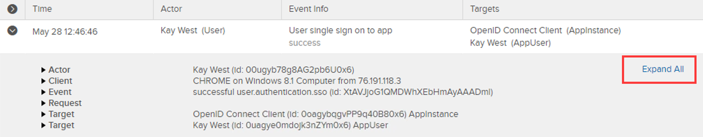

Back to [main page](README.md).

---

# Okta Customer Identity for Developers Lab Guide

Copyright 2022 Okta, Inc. All Rights Reserved.

## Module 1: Table of Contents

  - [Lab 1-1: Access Your Okta Org](#lab-1-1-access-your-okta-org)

  - [Lab 1-2: Create Okta Accounts](#lab-1-2-create-okta-accounts)

  - [Lab 1-3: Create an Okta Group](#lab-1-3-create-an-okta-group)

  - [Lab 1-4: Launch and Configure the Promos OIDC App](#lab-1-4-launch-and-configure-the-promos-oidc-app)

  - [Lab 1-5: Explore the System Logs](#lab-1-5-explore-the-system-logs)

## Lab 1-1: Access Your Okta Org
🎯 **Objective**:    Sign into your virtual machine and authenticate to your Okta organization.

⏱️ **Duration**:    15 minutes

---

1.  Sign into the virtual machine with the information provided by Okta.

    a.  Navigate to [**https://okta.instructorled.training**](https://okta.instructorled.training).

    b.  In the field labeled `Access Code`, enter the 10-digit code assigned to you by your instructor.

    c.  Click `Log in`.

    d.  Enter your first name and last name then click `OK`.

    e.  On the top menu, select `Lab`.

    f.  In the area labeled **Remote desktop**, click `Connect to the lab`.

    g.  In the Windows log in area, change the current user by clicking
        on the left arrow button to the left of the default profile
        picture.


h.  Select `Other user`.

i.  Enter the following credentials to log into Windows:
    ```
    Username: Administrator
    Password: Tra!nme4321
    ```


2.  Sign into your Okta org.

    a.  Launch your browser.

    b.  Navigate to your Okta org assigned to you by your instructor. For example:

    `https://oktaiceXXX.oktapreview.com`

    c.  On the **Okta Sign In** page, sign in with the following credentials:

     ```
     Username: oktatraining
     Password: Tra!nme4321
     ```

    d.  Select a recovery question and enter in a recovery answer.

    e.  Select a security image.

    f.  Click `Create My Account`

3.  Download the lab files.

    a.  Open a **Command Prompt** window.

    b.  Run the command
    ```bash
    cd \ &&  fetch_class_files platform
    ```
    d.  Close the Command Prompt window.

## Lab 1-2: Create Okta Accounts

  🎯 **Objective**:   Create an Okta service account for administrative tasks and associations with API tokens and create an end user account for testing configurations.

  🎬 **Scenario**:    For you to work with the Okta API, you need dedicated service and a test end user accounts.

  ⏱️ **Duration**:   10-15 minutes

---

### Create the Okta Service Account

📝 **Note**: The service account will be used for creating API Keys used in development tasks.

1.  In the Okta Admin interface, navigate to `Directory > People`

2.  To create an Okta super user that you will use as your service
    account, click `Add Person`.

3.  Complete the fields as follows:


 | Field                                    | Value                                   |
 | -----------------------------------------|-----------------------------------------|
 | First name                               | **Okta**                                |
 | Last name                                | **Service**                             |
 | Username                                 | `okta.service@oktaice.com`            |
 | Primary email                            | `okta.service@oktaice.com`            |
 | Secondary email                          | **Your work or personal email address** |
 | Password                                 | **Set by admin**                        |
 | Enter password                           | **Tra!nme4321**                         |
 | User must change password on first login | **Deselected**                          |


4.  Click **Save and Add Another**.

### Create the End User Test Account

1.  Complete the form in the modal that pops up with the following
    values:


  |**Field**                                  | **Value**                               |
  |-------------------------------------------|-----------------------------------------|
  | First name                                |  **Kay**                                |
  | Last name                                 |  **West**                               |
  | Username                                  |  `kay.west@oktaice.com`                 |
  | Primary email                             |  `kay.west@oktaice.com`                 |
  | Secondary email                           |  **Your work or personal email address**|
  | Password                                  |  **Set by admin**                       |
  | Enter password                            |  **Tra!nme4321**                        |
  | User must change password on first login  |  **Deselected**                         |                 

2.  Click **Save**.

### Assign Administrator Permissions

1.  Navigate to `Security > Administrators`.

2.  Click `Add Administrator`.

3.  In the `Add Administrator` dialog box, perform the following:

    a.  In the `Admin` field, type and select `Okta Service`.

    b.  In the `Role` field, select `Super Administrator`.

    c.  Click `Save Changes`.

### Activate the New Accounts

1.  From your browser, open a new incognito window (Chrome)/private
    window (Firefox).

2.  Navigate to your Okta org.

3.  On the Okta Sign In page, sign in with the following credentials:

```
Username: okta.service
Password: Tra!nme4321
```

4.  Select a recovery question and enter in a recovery answer.

5.  Click `Create My Account.`

6.  Close the window.

7.  To activate Kay's account, repeat steps 1-6, but use kay.west as the
    username.

## Lab 1-3: Create an Okta Group

  🎯 **Objective**   Create a group for all retailer users.

  🎬 **Scenario**   Retailers require a distinct group for application access and access policies.

  ⏱️ **Duration**     5-10 minutes

  ---

### Create a Retailers Group

1.  Sign on to Okta as `oktatraining` and return to the `Admin`
    interface.

2.  Navigate to `Directory > Groups`.

3.  Click `Add Group`.

4.  Complete the fields as follows:


  |**Field**                       | **Value**                            |
  |---------------------------------|-------------------------------------|
  | Name                            | Retailers                           |
  | Description                | All retailers                       |


5.  Click `Save`.

### Add People to the Retailers Group

1.  On the `Groups` page, click `Retailers`.

2.  Click the `Assign People` button.

3.  In the Search bar, search for `Kay West`.

4.  In the search results to the right of Kay West’s name, click the `+` button to add them to the Retailers group.

5.  Click `Save`.

## Lab 1-4: Launch and Configure the Promos OIDC App

  🎯 **Objective**    Configure the Promos OpenID Connect Client App in Okta.

  🎬 **Scenario**     Okta Ice is developing a custom application for their new
                  promos program called the Promos app, which is a Single Page
                  App (SPA) that will display promotions for customers.

  ⏱️ **Duration**    15 minutes

---

### Launch the Promos App

1.  Launch a Command Prompt window.

2.  Navigate to the Promos app directory:

```bash
cd \classfiles\platform\sso\ice-spa-app_sso_completed
```

3.  Install and launch the Promos app:

```bash
npm install
```

4.  Do not wait for the process to complete (it will take a few
    minutes). Move on now to the next steps below.

### Register the OpenID Connect Application

1.  If not already logged into your org as `oktatraining`, do so in
    Chrome.

2.  Expand **Application** , then click `Applications`.

3.  Click the `Create App Integration` button.

4.  Click the `OIDC -- OpenID Connect` radio button as the Sign-in
    method and click `Next`.

5.  Select `Single-Page App` radio button as the Application type and
    click `Next`.

6.  On the **General Settings** form, fill in the following values:

  |**Attribute**          | **Value**|
  |-----------------------|-----------------------------------------------|
  |App integration name   | Promos Green                                |
  | Grant type | Authorization Code |
  |Sign-in redirect URIs  | `http://localhost:8081/redirect`              |

7.  Under the **Assignments** section, select `Limit access to selected groups`

8.  In the `Selected group(s)` field, type and select `Retailers`

9.  Click `Save`.

10. In the Client Credentials section that pops up, copy the **Client ID** and paste its value in Notepad for later use.

Later, you use the Client ID inside the Promos Green app to identify the app to Okta when federating access with OIDC.

11. Scroll down to the **General Settings** section on this page and click `Edit`.

12.	Scroll down to **LOGIN** change the `Initiate Login URI` field to `http://localhost:8081/login`

13.  Click `Save`.

### Configure CORS for AJAX Calls

📝 **Note**: this is necessary because the Auth SDK will make an AJAX call
to `/.well-known/openid-configuration`.

1.  In the Admin page, navigate to `Security > API`

2.  In the **Trusted Origins** tab, click `Add Origin`.

3.  In the modal that pops up, provide the following information:


  |**Attribute**  | **Value**|
  |---------------|---------------------------------------------------------|
  |Name           | Promos Green                                            |
  |Origin URL     | `http://localhost:8081`                                 |
  |CORS           | <ul><li>- [x] (checked)</li></ul>                       |
  |Redirect       | <ul><li>- [ ] (unchecked)</li></ul>                     |


4.  Click `Save`.

5.  **Sign out** of Okta.

### Launch the Promos App

1.  Return to the Command Prompt window.

2.  Install the Okta Auth JavaScript SDK:

```bash
npm install @okta/okta-auth-js@4.9.x --save
```

3.  Set the host name for your Okta org, for example, **oktaice###**.
    Replace `<your-assigned-okta-subdomain>` with the value of the
    unique subdomain assigned to you in the spreadsheet distributed by
    your instructor.

```bash
set OKTA_SUBDOMAIN=<your-assigned-okta-subdomain>
```

4.  Set the Client ID for your OpenId Connect app. Replace `<client-id-value>` with the Promos Green Application's Client ID value you saved in Notepad. To paste, you can right click in the command prompt window.

```bash
set OKTA_CLIENT_ID=<client-id-value>
```

5.  Start the Promos Green app web server:

```bash
npm start
```

This should open `http://localhost:8081/home` in your default browser.

6.  Click `My Profile`. You will be redirected to your okta org for
    login.

7.  Sign in as `kay.west`. You should be able to see Kay\'s profile
    details in the ID token passed to the application.


8.  Click on `Logout of App` and close the browser.

9. Keep the web server running in the Command Prompt, as we will use the Promos Green app in `Labs 5-4` through `5-6`.

## Lab 1-5: Explore the System Logs

  🎯 **Objective**:   In this lab, you explore the Okta system logs to capture
                  information about some of the tasks you performed in this
                  Lab.

  ⏱️ **Duration**:    10-15 minutes

---

### Access the System Logs

1.  Access your Okta org as `oktatraining`.

2.  In the Admin console, navigate to `Reports > System Log`

The System Log page is displayed.

### View Promos App SSO events

1.  In the System Log page, search for Promos.

2.  You will see multiple events in the results similar to the
    screenshot below:

    

  a.  Under the **Actor** column lists the entity that initiated the
    event. Entities can be users (e.g., Kay West) or client applications
    (e.g. Promos Green).

  b.  The `Event Info` column displays the [outcome](https://developer.okta.com/docs/reference/api/system-log/#outcome-object) of the event. The outcome is a result (usually success or failure). If the result is a failure, a reason is also provided.

  c.  The `Target` column lists the entity that the actor performs an
    action on.

3.  Click the location button to show the event results in the map:

    

4.  Click the table button to return to the table results.

### Access User events

1.  Scroll to the top of the page and click `Advanced Filters`.

2.  In the filter:

    a.  Type `eventType` into the first field

    b.  Select `starts with` from the middle drop down

    c.  Type `user` into the last field

    d.  Click the `Apply Filter` button.

    The System log will display results only for user events. The search bar displays `eventType sw "user"` as criteria.

3.  In the `Actor` column of the results table, click `Kay West (User)`

    This filters on the events initiated by the user Kay West. The search bar is updated with a different query that resembles:

    ```bash
    eventType sw "user" and actor.Id eq "00u................"
    ```

### Explore Event details

1.  In the system log page, execute a search with the following
    criteria:

```bash
actor.alternateId sw "kay.west" and target.displayName eq "OpenID Connect Client"
```

2.  From the search results:

    a.  Find a successful authentication

    b.  Toggle the arrow button on the left to expand the entry

    c.  Click `Expand All`.



3.  Examine the events details:

    a.  The `Actor` section displays details about Kay West.

    b.  The `Client` section displays details about Kay West's device.

    c.  The `Event` and `Request` sections display information about the request and its outcome.

    d.  The `Target` section displays details about the Promos Green App.

📝 **Note**: that the event details for all events are available on this page.

---
Back to [main page](README.md).