Back to [main page](README.md).

---

# Okta Customer Identity for Developers Lab Guide

Copyright 2022 Okta, Inc. All Rights Reserved.

## Module 2: Table of Contents

  - [Lab 2-1: Make your first REST API Call to Okta](#lab-2-1-make-your-first-rest-api-call-to-okta)

  - [Lab 2-2: Manage Users via API](#lab-2-2-manage-users-via-api)

  - [Lab 2-3: (Optional) Manage Groups via API](#lab-2-3-optional-manage-groups-via-api)

  - [Lab 2-4: (Optional) Manage Groups Rules via API](#lab-2-4-optional-manage-groups-rules-via-api)

  - [Challenge 1: (Optional) Manage Admin Roles via API](#challenge-1-optional-manage-admin-roles-via-api)

  - [Challenge 2: (Optional) Manage Apps via API](#challenge-2-optional-manage-apps-via-api)

  - [Challenge 3: (Optional) Monitor Logs via API](#challenge-3-optional-monitor-logs-via-api)

  - [Challenge 4: (Optional) Extend User Attributes via API](#challenge-4-optional-extend-user-attributes-via-api)

## Lab 2-1: Make your first REST API Call to Okta

🎯 **Objective**:  Obtain a token for making API requests, configure Postman, make your first REST API request, and review some of the Okta Design Principles.

⏱️ **Duration**:    20 minutes

---

### Create an API Token

1.  Inside the VM, launch Chrome.

2.  Access your Okta org as `okta.service`.

3.  In the Admin interface, navigate to `Security > API`

4.  On the **Tokens** tab, click `Create Token`.

5.  Enter `Postman` as the token name and click `Create Token`.

6.  A **Token Value** is generated and displayed in a popup modal.

    Copy this value by clicking the clipboard button.

    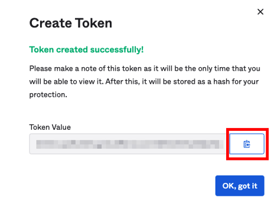

7.  Open Notepad on your VM and paste the token value into a new
    document named `API Token Postman.txt`

8.  Return to Okta and click `OK, got it`.

### Configure the Postman Environment

1.	In the VM, launch the Postman app (an orange circular icon).
2.	Click the `Import` button on the top left of the application.
3.	Click `Upload Files`.
4.	Navigate to `C:\ClassFiles\platform\rest\`.
5.	Open the `postman_environment.json` file.
6.	At the top of Postman, you will see a drop down that says No Environment. Click this drop down and select the environment you just imported: example.oktapreview.com.
7.	Click the eyeball icon next to the environment name to open up a quick look at the environment variables in this environment.
8.	Click Edit.
9.	Rename the environment from `example.oktapreview.com` to `oktaice###.oktapreview.com`, replacing `###` with your unique Okta org number.
10.	Update the **CURRENT VALUE**  (not INITIAL VALUE) of each environment variable specified below:

|**VARIABLE**       | **INITIAL VALUE**                  | **CURRENT VALUE**                 |
|-------------------|------------------------------------|-----------------------------------|
| <ul><li>- [x] url</li></ul>| `http://oktaice###.oktapreview.com`|`http://oktaice###.oktapreview.com`|
| <ul><li>- [x] apikey</li></ul>| Your `API Token` saved in Wordpad  | Your `API Token` saved in Wordpad |
| <ul><li>- [x] email-suffix</li></ul>| `oktaice.com`                |          `oktaice.com`            |

11.	Click `Persist All`.
12.	Click `Save`.
13.	You may now close the environment variable tab.

### Import Postman Collections

📝 **Note** In this section, you import the same API collections provided by Okta at [developer.okta.com](https://developer.okta.com/). For your convenience, we already downloaded all collections to your disk.

1.	Click the Import button on the top left of the application.

2.	Click Upload Files.

3.  Navigate to `C:\ClassFiles\platform\rest\collections\`

4.  Select and open all the `json` files.

Postman will display a confirmation message.

📝 **Note:** If a **Collection Exists** message is displayed, click `Replace`.

### Make your First API call to Okta

1.  Within the Collections pane on the left-hand side of Postman, expand
    the `Users (Okta API)` folder.

2.  Expand the `List Users` subfolder,

3.  Open the `GET List Users` request and click the `Send` button.

4.  Scroll down to review the JSON response that lists information about
    every user (e.g., `okta.service`) in your Okta org.

This, paired with the `200 OK` response code, confirms that your first REST API call to Okta is successful.


### Review the Request

📝 **Note:** Review the request to understand:

-   How Postman processes and sends information to Okta via REST APIs.

-   How to identify some of the Okta REST API Design Principles in your
    request.

You can use the steps below to review any other REST request made in
this lab.

1.  In Postman, review the `List Users` url bar:

    a.  Hover your mouse over `{{url}}` and confirm that your Okta Org URL is displayed.
    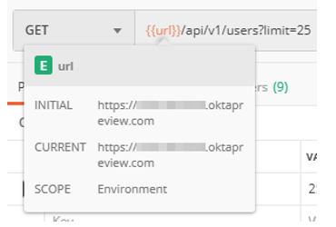

    This confirms that `{{url}}` is replaced with the value stored in your environment variable.

    📝 **Note:** In Postman, you can use environment variables to replace any request parameter or value.

    b.  The `GET /api/v1/users` URI corresponds to a [**Users API**](https://developer.okta.com/docs/reference/api/users/#list-users) endpoint for listing users in your Okta org.

    c.  The `limit` parameter specifies the number of results returned in the response. In our example, we are limiting the results to the first 25 users in the results.

    d.  The API accepts a variety of other [**request parameters**](https://developer.okta.com/docs/reference/api/users/#request-parameters-3) to refine your search.

2.  Click the `Headers` tab in the request area and confirm that the
    Authorization Header value is `SSWS {{apikey}}`.

    📝 **Note:**  The Authorization header submits the API token to Okta for authentication.

    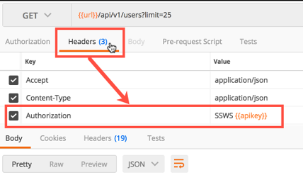

3.  Click the `Code` link located on the right side, under the Save button.

    Postman displays the Generate Code Snippet window.

    📝 **Note:** You can use this feature to generate code in different languages to accelerate your development.

4.  In the popup, select `cURL` to get generate a cURL command that
    corresponds to the request we just issued in Postman.

    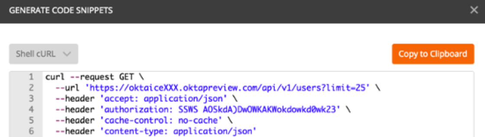

5.  Close the Generate Code Snippets window.


### Check your Request Rate Limits

📝 **Note:** You can use these steps to check rate limits on any other REST API request to Okta.

1.  In the `GET List User` request, scroll down to the response area, and click the `Headers` tab:

    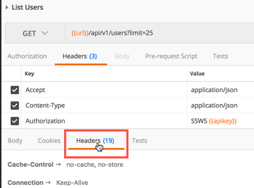

2.  Scroll down and locate the headers starting with `X-Rate-Limit`:

    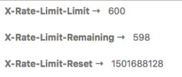

    📝 **Note:** `X-Rate-Limit-*` headers provide you a real-time status for your API consumption limits:

    -   `X-Rate-Limit-Limit` contains your current API limit.

    -   `X-Rate-Limit-Remaining` contains how many requests are still available.

    -   `X-Rate-Limit-Reset` shows when the rate limit count will be reset in Unix date (UTC timezone).\

  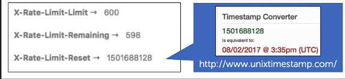

When developing an application to use Okta APIs, you can configure your app to read the API limits.

3.  *Optionally*, paste the `X-Rate-Limit-Reset` value on [www.unixtimestamp.com](http://www.unixtimestamp.com) to see when your current rate limit will reset.

###  ✅ Checkpoint

At this point, you created an API Key, made, and reviewed your first
REST API request to Okta. In the next labs, you will perform
administrative tasks using the APIs.

## Lab 2-2: Manage Users via API


🎯 **Objective**:  Create, Search, Modify, and Delete users from Okta.

⏱️ **Duration**:   30 minutes                                           |

⚠️ **Prerequisite**: Completion of [Lab 2-1](#lab-2-1-make-your-first-rest-api-call-to-okta).

---

### Review the Create Users Requests

1.  Back in the Collections pane in Postman, examine the list of requests within the collection `Users (Okta API) > Create User`.

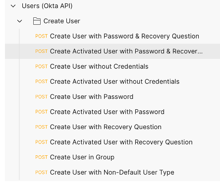

The `Create Users` folder contains various requests for creating users.

2.  Open and review each of these requests.

 📝 **Note:** You will notice that:

-   All requests are sent as a `POST` request to the same endpoint
    (`/api/v1/users`).

-   Every request sends the `API key` through the `Authorization`
    header.

-   Each request has different data in the **request body**. The
    request body specifies information about the user that will be
    created. This may include the user profile, password,
    and password recovery questions.

-   These requests use `activate` as a **query parameter**. This
    [query parameter dictates how the user will be created]{.underline}.
    When the `activate` parameter is set to `true`, the user is
    activated automatically upon creation.

-   The rules above are applicable to all APIs in Okta. The request body
    provides information about **what** is being created or updated --
    user, group, app, or configuration. The query parameters determines
    **how** this entity will be created.


### Create Users

📝 **Note:** You can copy and paste the requests from the
`C:\ClassFiles\platform\rest\solutions` folder.

1.  From the Collections panel in Postman, look under `Users (Okta API) > Create User` and open the `Create Activated User with Password & Recovery Question` request.

2.  Within the request `Body` tab, update the profile section (`lines 2-7`) to include additional information about the user

```json
"profile": {
    "firstName": "Isaac",
    "lastName": "Brock",
    "email": "isaac@{{email-suffix}}",
    "login": "isaac@{{email-suffix}}",
    "nickName": "IB",
    "title": "Senior Engineer",
    "department": "IT",
     "division": "EMEA"
 },
 ```

📝 **Note:** The API [documentation](https://developer.okta.com/docs/api/resources/users#profile-object) contains additional profile properties you can define.

3.  Now update the credentials section of the request `(lines 8-14)` as follows:

```json
"credentials": {
    "password" : {
        "value": "Tra!nme4321"
    },
    "recovery_question": {
        "question": "What's your favorite soccer team?",
        "answer": "Chelsea"
    }
}
```

4.  After checking that your request body looks like the screenshot below,
    click `Send`.

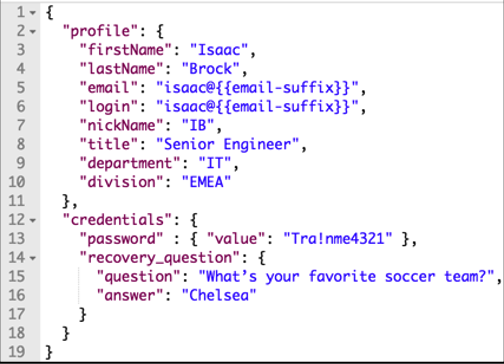

5.  Verify that the response status is `200 OK` and that the response
    body contains information about the user that you submitted in your
    request.

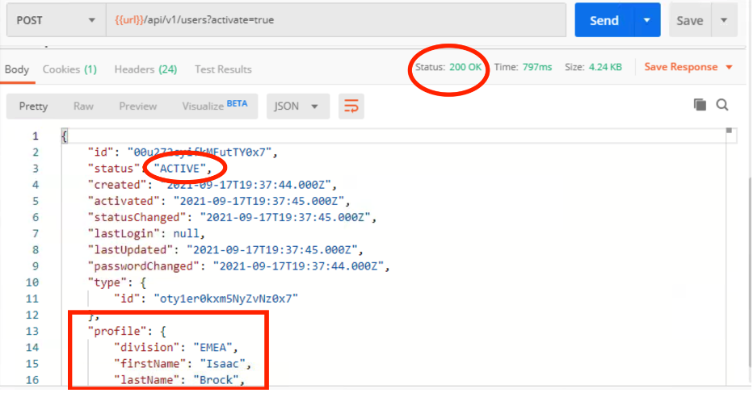

The response above confirms that the user has been created AND
activated.

6.  Take a look at the id property in the response body.

📝 **Note:** This field works as a unique identifier for the user. Later in this lab, you will learn how to use this information to manage existing users.

7.  Scroll down through the response and find the `_links` section:

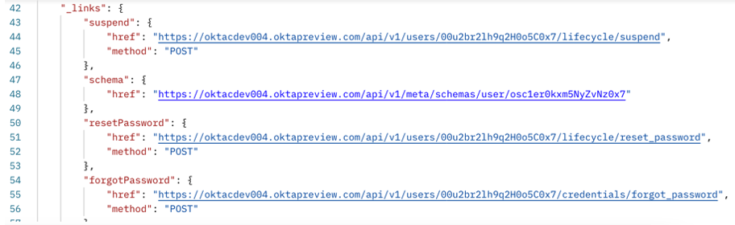

📝 **Note:**  The `_links` section provides links to additional REST API requests that you can make for this user, following the Hypermedia Application Language (HAL) standard. Notice that the user `id` is part of these URLs.

8.  Access your Okta org and sign-in as `isaac@oktaice.com` (password
    `Tra!nme4321`).

You should be able to log in.

9.  Sign-out of Okta.

📝 **Note:** This user has some properties (e.g. `costCenter`) that are not listed in the initial user creation. For a complete list of profile properties, visit the [documentation](https://developer.okta.com/docs/api/resources/users.html#profile-object).

10. Return to Postman and create an additional user using the table as
    reference:


| **User**       | **attribute**      | **value**                      |
|----------------|--------------------|--------------------------------|
| Igor Dean      |  `firstName`       | Igor                           |
|                |   `middleName`     | Garcia                         |
|                |   `lastName`       | Dean                           |
|                |   `email`          | igor.dean@{{email-suffix}}     |
|                | `login`            | igor.dean@{{email-suffix}}     |
|                | `title`            | Security Engineer              |
|                | `department`       | Information Security           |
|                | `division`         | EMEA                           |
|                | `costCenter`       | Security                       |
|                | `password`         | Tra!nme4321                    |
|                | `answer`           | Barcelona                      |


### Search for all Users

1.  In the Collections pane under `Users (Okta API)` > List `Users`, open the `List Users` request.
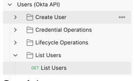

2.  **Send** the request.

3.  Confirm that the response returns a list of users, including your newly added users, Isaac and Igor.

### Use search filters

1.  Update the request URL with the following query string:

```bash
filter=(status eq "ACTIVE") and (profile.firstName eq "Isaac")
```

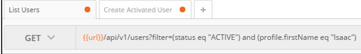

2.  Click `Send`.

3.  Confirm that the response contains only the user `Isaac Brock`.

## Use search pagination

1.  Update the request url with the following query string:

```bash
 filter=(status eq "ACTIVE")
```

2.  Click `Send`.

The response should return a few users.

Note the order in which the users are listed in the response.

3.  Update the request to limit the number of results to one.

```bash
filter=(status eq "ACTIVE")&limit=1
```

4.  Click `Send`.

The request returns the first active user from the results. The `limit` parameter can be used to configure how many results are displayed when using [pagination](https://developer.okta.com/docs/reference/core-okta-api/#pagination).

5.  Click on the `Headers` tab of the **response**.

6.  Locate the Link header with the `rel="next"` property.

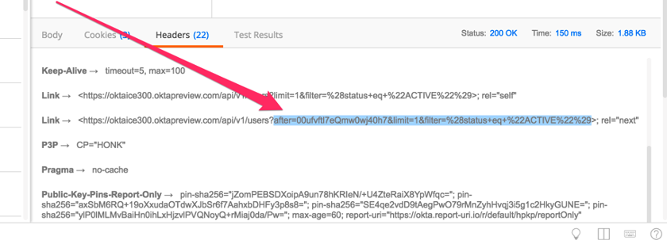

7.  Copy the `after` query string from the URL of the Link header and paste it into Postman to replace the `limit` query string currently there.

```http
{{url}}/api/v1/users?**after=00u...
```

8.  Click `Send`.

This will return the next user in the result list. Copy this user's `id`.

9.  In the address bar, change `after` to `before` and update the `id` value with the one you just copied.

```http
 {{url}}/api/v1/users?before=00u...
```

10. Click `Send`. This should be the first user again.

## Change the User Password

1.  Search for the user Isaac Brock by updating your `List User` request with the following query parameters:

```http
?filter=profile.email eq "isaac@oktaice.com"
```

2.  From the search results, select and right-click the id and then
    select `Set: oktaiceXXX.oktapreview.com` > `userId`:

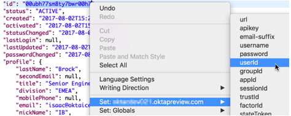

This sets the `userId` environment variable with Isaac's id.

3.  Click on the `eye icon` in the upper right corner to verify the current value of your environment variables. The value of userId should be set to Isaac's id.

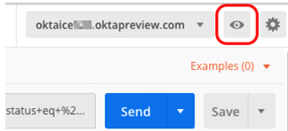

4.  In the Collections panel, expand the folder `Users (Okta API)` > `Credential Operations`.

The [**Credential Operations**](https://developer.okta.com/docs/reference/api/users/#credential-operations) endpoint exposes methods of setting and updating a user's login
credentials.

📝 **Note:**

-   The **Change Password** request can only be used by validating the
    user's currently set password.

-   The **Forgot Password** request allows the user to change their
    password when the currently set password has been forgotten. The
    user must answer the previously set security question to use this
    method.

-   The **Set Password** request requires no validation of credentials
    and is an administrative operation. While the previous requests are
    meant for user self-service, this request is meant for
    administrative purposes only.

5.  Open the **Set Password** request.

6.  Hover over the `{{userId}}` variable in the request to confirm
    that it has a current value (Set in Step 2).

7.  Click on the **Body** tab and replace the `{{password}}` variable
    with the following hardcoded value:

```json
{
    "credentials": {
        "password": {
            "value": "Tra!nme1234"
        }
    }
}
```

8.  Click  `Send`.

9.  Okta returns the response status code `200 OK`. This confirms that the request was successful.

10. Optionally, log in to your Okta org as `isaac@oktaice.com` (password: `Tra!nme1234`) to confirm the password change.

### Update User

📝 **Note:** You can copy and paste the requests from the following folder:
```bash
C:\ClassFiles\platform\rest\solutions
```

1.  From the Collections panel, expand the `Users (Okta API) > List Users` folder.

2.  Open the `Get User` request and click `Send`.

The API returns information about Isaac Brock since the environment variable `{{userId}}` is currently set to Isaac's id.

3.  This request currently uses the HTTP method `GET`. Change the
    method to `POST`.

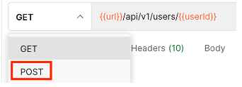

4.  Click the request **Body** tab and then select the `raw` radio
    button.

5.  To update Isaac's title and add a mobile number, enter the following
    information in the body:
```json
{
    "profile": {
        "title" : "Principal Developer",
        "mobilePhone": "+12 3214-1234"
    }
}
```
6.  Click `Send` and confirm that you receive a `200 OK` status
    code.

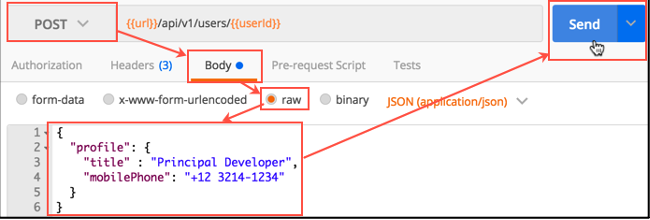

7.  In the response body, confirm that both title and mobilePhone have
    been updated with the new values.

8.  Close the `Get User` request without saving the changes you made to the request.

9.  *Optionally*, log in to your Okta org as `oktatraining` to
    confirm that the changes are reflected in the UI under:
    `Directory` > `People` > `Isaac Brock` > `Profile`.

   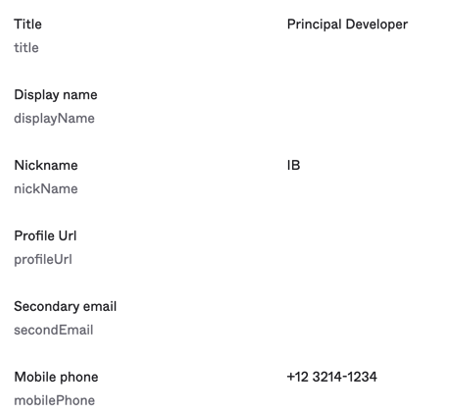

### Disable User

1.  In the Collections Panel, expand the folder `Users (Okta API)` > `Lifecycle Operations`.

The Lifecycle Operations folder contains requests that can be used to change the user status in Okta.

2.  *Optionally*, open and review the URIs of some of the Lifecycle Operations collections.

You will notice that all lifecycle operations are defined in the URI:

```html
{{url}}/api/v1/users/{{userId}}/lifecycle/<operation>
```

3.  Open the `Deactivate User` request and hover `{{userId}}` to confirm it has a current value (Set in Step 2 of **Change the User Password**).

4.  Click `Send`. The response will return a `200 OK` status code, but there will be no information sent in the response body.

5.  To confirm that Isaac is deactivated, open your browser and:

    a.  Log in to your Okta org as `oktatraining`.

    b.  In the **Admin** UI, click `Directory` > `People`.

    c.  Click `Deactivated` and confirm that the Isaac is listed.

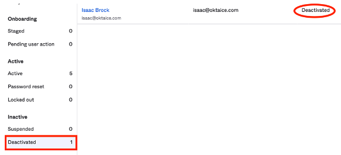

6.  Minimize your browser and return to **Postman**.

7.  Optionally, expand the `Users (Okta API)` folder in the Collections panel and open the `Get User` request and click `Send`.

    a.  Confirm that Isaac's account is deactivated by verifying that the response body contains:

    ```json
    (status=DEPROVISIONED)
    ```

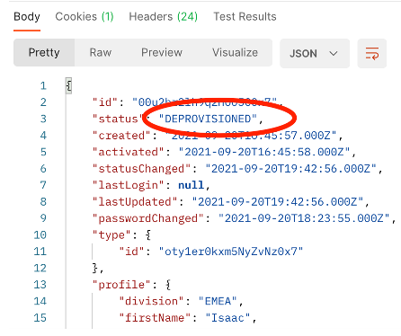

### Delete User

1.  Expand the `Users (Okta API)` folder and select the `Get User`
    request.

2.  Change the HTTP request method from `GET` to `DELETE`.
   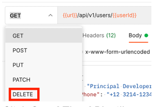

3.  Click `Send`. The API will return the status code `204 No Content`. This confirms that Isaac's account has successfully been deleted.

4.  Open your browser and:

    a.  Log in to your Okta org as `oktatraining`

    b.  Click `Directory` > `People`, and confirm that Isaac's account is no longer present under Active or Inactive.

 ### ✅ Checkpoint
At this point, you have learned to manage **Users** using the Okta REST
API. In the next lab, you will learn how to manage **Groups** via the API.

## Lab 2-3: (Optional) Manage Groups via API

  🎯 **Objective**   Create and search groups in Okta. Manage group membership.  

  ⏱️ **Duration**     10 minutes

  ⚠️ **Prerequisite**: Completion of [Lab 2-1](#lab-2-1-make-your-first-rest-api-call-to-okta).

---

### Create Groups

📝 **Note** You can copy and paste the requests from:

```bash
C:\ClassFiles\platform\rest\solutions
```

1.  In Postman, open the `Groups (Okta API)` > `Add Group` collection.

 📝 **Note:** This collection is similar to the Create User API.

2.  Update the request body as follows:

 📝 **Note:** Groups have only two basic attributes: name and description.

```json
 {
    "profile": {
        "name": "IT",
        "description": "For IT Users"
    }
 }
 ```

 📝 **Note:** Groups have only two basic attributes: name and description.

3.  Click `Send`.

4.  Verify that Postman displays the status `200 OK` and information about the group created under the response body.

This confirms that the group is created.

5.  *Optionally*, access your Okta org as `oktatraining` to confirm that the group is created.

6.  Create a second group using the table as reference:


| **Group Name**| **Group Description**                                |
|---------------|------------------------------------------------------|
| Security      | For Information Security Users                       |


7.  From the creation results, select and right-click the `id` for the
    Security Group and then select `Set: oktaiceXXX.oktapreview.com` > `groupId`


This sets the `groupId` environment variable with the Security group id.

### Add Group Members

1.  Open the `Users (Okta API)` > `Find User` collection and then search for Igor Dean.

```html
filter=profile.firstName eq "Igor"
```

2.  From the search results, select and right-click the `id` and then select `Set: oktaiceXXX.oktapreview.com` > `userId`

This sets the `userId` environment variable with Igor's id.

3.  Open the `Groups (Okta API)` > `Add User to Group` collection.

4.  Review the URL. The groups API has a specific endpoint to manage the
    user membership in the group.

5.  Click `Send`.

The group API will return the code `204 No Content`. This confirms that the Igor is added to the Security Group.

### Check the Group Membership

1.  Open the `Groups (Okta API)` > `List Group Members (Users)` collection.

2.  Click `Send`.

3.  Confirm that Igor Dean is listed in the response body.

### Remove Group Members

1.  Open the `Groups (Okta API)` > `Remove User from Group` collection.

2.  Review the URL. Comparing to the Add User to Group collection, this
    request just changes the method from `PUT` to `DELETE`.

3.  Click `Send`.

The group API will return the code `204 No Content`. This confirms that the Igor is removed from the Security Group.

4.  *Optionally*, execute the `Groups (Okta API)` > `List Group Members (Users)` collection to confirm that Igor is no longer a member of the Security Group.

### Search For All Groups

1.  Open the `Groups (Okta API)` > `List Groups` collection.

2.  Click `Send`.

3.  Confirm that the search returns the groups.

### Use Search Filters

1.  Update the request url with the following query string, replacing
    YYYY-MM-DD with the current date.


```html
filter=lastUpdated gt "YYYY-MM-DDT00:00:00.000Z"
```

 📝 **Note:** For example, enter `2022-03-24` for March 24, 2022.

2.  Click `Send`.

3.  The request will return all groups created or modified today.

### ✅ Checkpoint

At this point, you managed groups and their membership using the Okta REST API.

In the next labs, you manage groups rules via APIs.

## Lab 2-4: (Optional) Manage Groups Rules via API

  🎯 **Objective:**   Create and Activate a group rule in Okta. Verify results.

  ⏱️ **Duration:**     10 minutes

  ⚠️ **Prerequisite:** Completion of [Lab 2-1](#lab-2-1-make-your-first-rest-api-call-to-okta).

  📝 **Note:** Group rules are used to assign users automatically to groups based on their attributes.

---

### Create a Group Rule

📝 **Note:** You can copy and paste the requests from the following folder:
```bash
C:\ClassFiles\platform\rest\solutions
```

1.  Open the `Groups (Okta API)` > `Add Group` collection.

2.  Change the request url to the `rules` endpoint:

```html
{{url}}/api/v1/groups/rules
```

3.  Update the request body as follows:

```json
{
  "type": "group_rule",
  "name": "Security rule",
  "conditions": {
    "people": {
      "users": {
        "exclude": []
      },
      "groups": {
        "exclude": []
      }
    },
    "expression": {
      "value": "user.costCenter==\"Security\"",
      "type": "urn:okta:expression:1.0"
    }
  },
  "actions": {
    "assignUserToGroups": {
      "groupIds": [
        "{{groupId}}"
      ]
    }
  }
}
```

📝 **Note:** The request body describes the Group Rule `Security rule`.
This rule assigns all users with the `costCenter=Security` to the Security group (`groupId` set).

4.  Click `Send`.

The group API will return the code `200 OK`. This confirms that the rule is created.

5.  On the response body, select and right-click the `id` and then
    select `Set: oktaiceXXX.oktapreview.com` > `ruleId`

### Activate Rule

1.  Update the request url to:

```html
 {{url}}/api/v1/groups/rules/{{ruleId}}/lifecycle/activate
 ```

2.  Delete the request body contents.

3.  Click `Send`.

The API returns the code `204 No Content`. This confirms that the rule has been activated.

### Check the Rule

1.  Access your Okta org as `oktatraining`.

2.  In the **Admin** UI, click `Directory` > `Group`.

3.  Click `Rules`.

4.  Confirm that the Security rule is created and activated:

 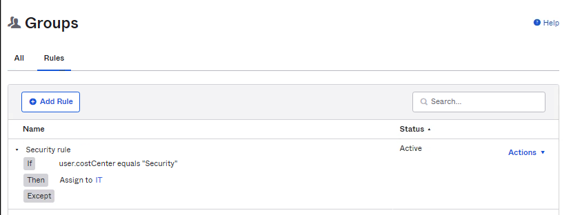

5. Click `All` > `Security`.

6.  In the **People** tab, confirm that Igor is a group member managed
    by the Security rule:

 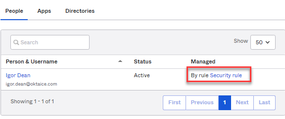

### ✅ Checkpoint

At this point, you managed groups using the Okta REST API.

The remaining labs contain REST API challenges. Each challenge presents:

-   A summary of tasks you need perform.

-   A list of tips for performing each challenge.

Because you're already familiar with the Postman interface and Okta's
REST API design principles, the challenges are not procedural.

## Challenge 1: (Optional) Manage Admin Roles via API

🎯 **Objective:**   Apply your REST API skills to manage admin roles.

⏱️ **Duration:**     15 minutes

⚠️ **Prerequisite:** Completion of [Lab 2-1](#lab-2-1-make-your-first-rest-api-call-to-okta).

---

📝 **Note:** If you don't have time to execute the challenges in class, you can execute them on any Okta org, using the REST API collections provided at
https://developer.okta.com/code/rest/.

**Tasks:**
- [ ] Grant Igor Dean the **Read Only Admin** role
- [ ] Confirm that the role has been granted
- [ ] Revoke Igor Dean's **admin privileges**

**Hints:**

-   To assign an Admin role, you need to first set the `userId` environment variable. You can use the `Users (Okta API) > Find Users` collection for that. For example:

```html
filter=(status eq "ACTIVE") and (profile.firstName eq "Igor")
```

-   To assign the Admin role, you can use the `Admin Roles (Okta API)` > `Assign Role to User` collection

-   To figure out what role type you should use, check the [Admin Role
    documentation](https://developer.okta.com/docs/api/resources/roles.html#role-types).

-   You can verify the results in either the Admin Dashboard or via the REST API.

-   To check results in the Admin Dashboard, access Okta as an Administrator and go to `Security` > `Administrators`.

-   To revoke the Admin Role, you need to first set the `roleId` environment variable.
    To find the `roleId`, you can use the `List Roles assigned to User` collection.

### ✅ Checkpoint

At this point, you know how to apply your Okta REST API skills to manage
Administration Roles. In the next challenge, you Manage Applications via
REST APIs.

## Challenge 2: (Optional) Manage Apps via API

🎯 **Objective:**   Apply your REST API skills to register an Application in Okta and assign it to users.

⏱️ **Duration:**     30 minutes

⚠️ **Prerequisite:** Completion of [Lab 2-1](#lab-2-1-make-your-first-rest-api-call-to-okta).

---

📝 **Note:**

-   If you don't have time to execute the challenges in class, you execute them on any Okta org, using the REST API collections provided in https://developer.okta.com/code/rest/.

-   For executing this challenge, you *must* have the [Okta Browser Plugin](https://help.okta.com/en/prod/Content/Topics/Apps/Apps_Browser_Plugin.htm) installed. It is installed in our course VMs, but note that you will need to install it if you attempt the lab outside of our VMs.

**Tasks:**

- [ ]  Register Okta Ice Secret Recipes as Application (ask your instructor for the app credentials)
- [ ]  Assign the Okta Ice Secret Recipes app to the `Everyone` group.
- [ ]  Test the Application access.

**Hints:**

- You can copy-paste the requests from the solutions folder:

   ```
   C:\ClassFiles\platform\rest\solutions
   ```
-   To create the app, use the `Apps (Okta API)` > `Add Application` > `Add Custom SWA App` collection with the following request body:
```json
{
  "label": "Okta Ice - Secret Recipes",
  "visibility": {
    "autoSubmitToolbar": false,
    "hide": {
      "iOS": false,
      "web": false
    }
  },
  "signOnMode": "AUTO_LOGIN",
  "credentials": {
    "scheme": "SHARED_USERNAME_AND_PASSWORD",
    "userName": "<USERNAME>",
    "password": "<PASSWORD>",
    "revealPassword": false,
    "signing": {}
  },
  "settings": {
    "signOn": {
      "redirectUrl": "http://login.oktaice.cloud",
      "loginUrl": "http://login.oktaice.cloud"
    }
  }
}
```

-   To assign the Okta Ice - Secret Recipes App to the `Everyone` group,
    you will need to record both the `appId` and the `groupId`.

-   To find out the **Okta Ice -- Secret Recipes's** `appId`, you can use
    the `Apps (Okta API)` > `List ACTIVE Apps` collection.

-   If you don't remember how to get a group id, review [Lab 2-3: Manage Groups via API](#lab-2-3-optional-manage-groups-via-api).

-   To assign a group to an app, use the `Apps (Okta API)` > `Assign Group to App` collection.

-   To test the app, access your Okta org as `oktatraining` and select the **Okta Ice - Secret Recipes** chiclet from **My Applications**. Afterwards, you will be logged in to this application.
 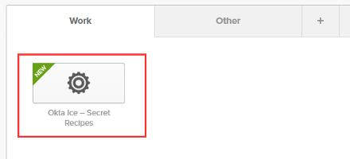


### ✅ Checkpoint

After completing this challenge, you know how to manage Applications
using your Okta REST API skills. In the next challenge, you will monitor
your Okta Org logs via REST APIs.

## Challenge 3: (Optional) Monitor Logs via API

🎯 **Objective:**   Apply your REST API skills to read logs.

⏱️ **Duration:**     30 minutes

⚠️ **Prerequisite:** Completion of [Lab 2-1](#lab-2-1-make-your-first-rest-api-call-to-okta).

---

📝 **Note:** If you don't have time to execute the challenges in class, you
execute them in your Okta org, using the REST API collections provided
in https://developer.okta.com/code/rest/.

**Goals:**

- [ ]  Check **all users created today**.

- [ ] Check all transactions related to **Okta Ice Secret Recipes**.

- [ ]  Check all transactions related to **Igor Dean**.

- [ ]  Check all logs originated in **United States**.

- [ ]  Monitor a **create user transaction**.

**Hints:**

-   To execute all tasks listed above, use the collections under **Logs
    (Okta API)**.

-   The [System Log API documentation](https://developer.okta.com/docs/api/resources/system_log.html#list-events) provides the list of parameters you can use to narrow down your searches.

-   The **System Log UI** (found in the Admin UI, under `Reports` > `System Logs`) exposes a search bar that uses  filters that can be ported to the API.

For example:

 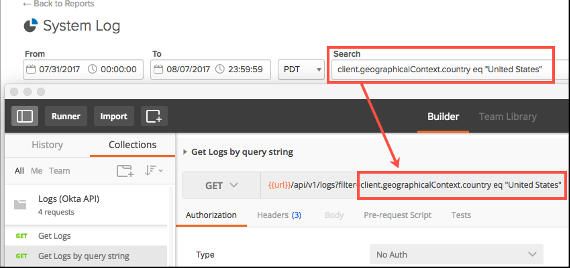


-   Here are some additional filter samples:

**User creation**

```bash
?filter=eventType eq "user.lifecycle.create"
```

**Logs generated since Aug-07-2021**

```bash
&since=2021-08-07
```

**Logs generated in Brazil**

```bash
?filter=client.geographicalContext.country eq "Brazil"
```

**Login from John Doe to Zendesk**

```bash
? target.displayName eq "Zendesk" and eventType eq "user.authentication.sso" and target.alternateId eq "jdoe@oktaice.com"
```

-   To monitor the create user transaction:

    a.  Create a user via APIs (for example, Johnny Dean).

    b.  From the results header, copy the `X-Okta-Request-Id` header
        value.

    c.  Search for the logs with a transaction matching the
        `X-Okta-Request-Id` header.

```bash
?filter=transaction.id eq "<X-OKTA-REQUEST-ID>"
```

 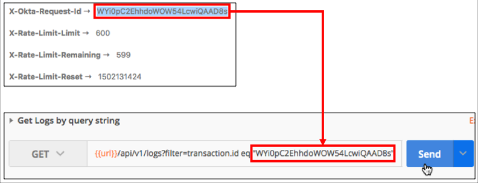

### ✅ Checkpoint

After completing this challenge, you know how to review the Okta Logs
using your Okta REST API skills. In the final REST API challenge, you
extend the User Schema using the Okta APIs.


## Challenge 4: (Optional) Extend User Attributes via API

🎯 **Objective:**   Apply your REST API skills to extend the user schema with new attributes.

⏱️ **Duration:**     30 minutes

⚠️ **Prerequisite:** Completion of [Lab 2-1](#lab-2-1-make-your-first-rest-api-call-to-okta).

---


📝 **Note** If you don't have time to execute the challenges in class, you execute them in your Okta org, using the REST API collections provided in https://developer.okta.com/code/rest/.

**Goals**

- [ ]  **Extend** the User schema with a new attribute: `Twitter username`

- [ ] **Create a user** with a Twitter username.

- [ ] **Remove** the twitter username from the user schema.

**Hints:**

-   To extend the user schema, you can use the `Schemas (Okta API)` > `Add Property to User Profile Schema` collection. This collection comes up with a sample request that you can use to create the Twitter username filter.

- You can copy-paste the requests from the solutions folder:

   ```
   C:\ClassFiles\platform\rest\solutions
   ```

-   If you don't remember how to create a user, review [Lab 2-2: Manage Users via API](#lab-2-2-manage-users-via-api).


-   When creating a user (for example, John Doe), do not forget to add
    your new field (`twitterUserName`). For example:

```json
{
  "profile": {
    "firstName": "John",
    "lastName": "Doe",
    "twitterUserName": "@jdoe",
    "email": "john@{{email-suffix}}",
    "login": "john@{{email-suffix}}"
  },
  "credentials": {
    "password" : { "value": "Tra!nme4321" },
    "recovery_question": {
      "question": "What's the best food?",
      "answer": "Ice Cream"
    }
  }
}
```

-   You can verify the results in either the Admin Dashboard or via the REST API.

-   To check results in the Admin Dashboard:

    a.  Access Okta as `oktatraining`.

    b.  In the Admin UI, go to `Directory` > `People`.

    c.  Click the user you created.

    d.  Click Profile.

    e.  Under profile, confirm that the Twitter username attribute exists and is populated.
 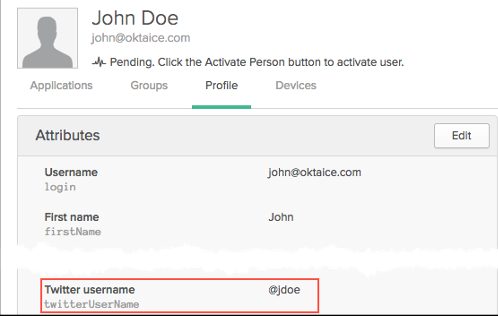

-   To remove the Twitter attribute from the user schema, you can use
    the `Schemas (Okta API)` > `Remove Property from User Profile Schema` collection.

-   To confirm that the attribute is removed, review the user you created for tests. The user shouldn't have the Twitter username field.

### ✅ Checkpoint

Congratulations for completing all the challenges. At this point, you
should be able to consistently use your REST API skills to leverage any
Okta REST API documentation and collection

---
Back to [main page](README.md).