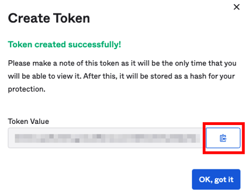

Back to [main page](README.md).

---

# Okta Customer Identity for Developers Lab Guide

Copyright 2022 Okta, Inc. All Rights Reserved.

## Module 3: Table of Contents

  - [Lab 3-1: Implement Self Service Registration](#lab-3-1-implement-self-service-registration)

  - Lab 3-2: Create a Registration Page Using Okta Management SDK 
    - [Java ☕](#lab-3-2-create-a-registration-page-using-the-okta-management-sdk---java)  ** ***OR*** **  [.NET 🟣](#lab-3-2-create-a-registration-page-using-the-okta-management-sdk---net)

##  Lab 3-1: Implement Self Service Registration

🎯 **Objective**   Enable the self-service registration page provided with Okta
                  out of the box.

🎬 **Scenario**    Okta Ice would like to try the self-service registration
                  feature for new retailers.

⏱️ **Duration**     10 minutes

---

### Configure the Self-Service Registration Page

1.  In the VM, launch **Chrome**.

2.  Login to your Okta org as `oktatraining`.

3.  On the Admin page, navigate to `Directory` > `Self-Service Registration` within the left navigation menu.

4.  Click the `Enable Registration` button, which opens the **Self-Service Registration** configuration page.

5.  In the `Account` section, set the following values:

  |**Attribute**                | **Value**                                 |
  |-----------------------------|-------------------------------------------|
  |Self-service registration    | Enabled                                   |
  |Add to Sign-In widget        | <ul><li>- [x] (checked)</li></ul>         |
  |Assign to group              | Retailers                                 |


6.  In the **Registration Form** section verify the following settings:

  |**Attribute**                | **Value**                                 |
  |-----------------------------|-------------------------------------------|
  |`firstName`  Required box    | <ul><li>- [x] (checked)</li><ul>          |
  |`lastName`  Required box     | <ul><li>- [x] (checked)</li></ul>         |


7.  In the **Post-registration** section verify the following settings:

  |**Attribute**                | **Value**                                 |
  |-----------------------------|-------------------------------------------|
  |Activation Requirements      | <ul><li>- [x] (checked)</li><ul>          |
  |Default redirect             | User dashboard                            |


8.  Click `Save`.

### Test the Self-Service Registration Page

1.  **Sign out** from Okta as `oktatraining`.

2.  On the sign-in page, click `Sign up`.

3.  **Create Account:** Enter in an email address you can access, the
    password `Tra!nme4321`, and your first and last name.

4.  Click `Register`.

5.  Check your email for the activation email. In the email, click on
    the link for `Activate Account`.

6.  If prompted, setup a recovery question and answer, and select a
    security image.

7.  Verify that your new user lands on the End User Dashboard after
    logging in.

8.  **Sign out** of Okta.

## Lab 3-2: Create a Registration Page Using the Okta Management SDK - Java

🎯 **Objective:**   Create the registration page for the retailer persona.

⏱️ **Duration:**     25-30 minutes

☕ This lab uses the [Okta Management **Java** SDK](https://github.com/okta/okta-sdk-java/). You can alternatively complete this lab in [.NET](#lab-3-2-create-a-registration-page-using-the-okta-management-sdk---net)

---

### Create an API Token

1.  If you are not already in the **VM**, sign in to [the VM](http://okta.instructorled.training).

📝 **Note** For detailed instructions on doing this, [Lab 1-1](module1.md#lab-1-1-access-your-okta-org) Step 1 contains the step-by-step process.

2.  Inside the VM, launch **Chrome**.

3.  Sign into your Okta org as `okta.service`.

4.  In the Admin menu on the left, select `Security` > `API`.

5.  On the **Tokens** tab, click `Create Token`.

6.  Enter `Java Training App` as the token name and click `Create Token`.

7.  A **Token Value** is generated and displayed in a popup modal.

8.  Copy this value by clicking the clipboard button.



9.  Open Notepad on your VM and paste the token value into a new document named `API Token Java.txt`

10. Return to Okta and click `OK, got it`.

### Make the First Name and Last Name fields Optional

1.  In the Admin menu on the left, navigate to `Directory` > `Profile Editor`.

2.  Click on `User (default)`

3.  Scroll down to find the `First name` attribute and click on the circular information button.

4.  Uncheck `Attribute Required`

5.  Click `Save Attribute`.

6.  Repeat steps 3-5 for the `Last name` attribute.

### Open the Project in IntelliJ

1.  On your VM, on the **Windows Taskbar**, click the `IntelliJ` icon.

2.  Click `Open`.

3.  Navigate to `C:\` and click the **refresh** button.

4.  Expand `ClassFiles` > `platform` > `java`* select `pom.xml` and
    click `OK`.

5.  Click `Open as Project`.

6.  Wait for the Maven build to complete.

7.  If not opened already, click `View` > `Tool Buttons` so you can
    easily switch between tool windows.

### Examine the Project Dependencies

1.  Open the `pom.xml` file.

2.  Note the `<parent>` section:

`spring-boot-starter-parent` makes this a Spring Boot project

3.  Note the `<dependencies>` section:

**compile dependencies:**

`spring-boot-starter-web` makes this a web based project

`spring-boot-starter-thymeleaf` uses the Thymeleaf templating system for views

`okta-authn-sdk-api` is the Okta Authentication API Java SDK

`okta-sdk-api` is the Okta Management API Java SDK

`fluent-hc` is the Apache Fluent HTTP REST client library

**runtime dependencies:**

`okta-authn-sdk-impl` is the Okta Authentication API Java implementation SDK

`okta-sdk-impl` is the Okta Management API Java implementation SDK

`okta-sdk-httpclient` is the Okta API HTTP communication client

4.  You will work in the `work-in-progress [okta-platform-wip]` project folder. Expand this folder.

5.  The `complete [okta-platform-complete]` folder contains the solutions.

### Configure the Application

1.  Right-click `work-in-progress` > `src` > `main` > `java` > `com.okta.examples` > `OktaPlatformDemoApplication`

2. Click: `Create 'OktaPlatformDemoApplication.main()'`

3. Click `OK`

4.  Open the `work-in-progress` > `src` > `main` > `resources` > `application.yml` file

5. Update the `okta.client.orgUrl` property with yout Okta org's URL.

6. Update the `okta.client.token` property with the **API token** you created and saved to `API Token Java.txt`.

### Configure the Registration Page

1.  Open the ` work-in-progress` > `src` > `main` > `resources` > `templates` > `register.html` file.

2.  We will add some frontend code to this file that will display the
    backend results of a user's registration attempt. If registration
    succeeds, we display the `status` and the `userId`. But if
    registration fails, we display the HTTP status code and the error
    summary.

    Enter the code below after the comment on `Line 12`:

```html
<!-- 
  👇 Lab 3-2:
  TODO: Add code that will display registration results 
-->
<h4 style="color:green" th:if="${status}" th:text="${status}"></h4>
<h4 style="color:green" th:if="${userId}" th:text="${userId}"></h4>
<h4 style="color:red" th:if="${statusCode}" th:text="${statusCode}"></h4>
<h4 style="color:red" th:if="${errorSummary}" th:text="${errorSummary}"></h4>
```

3.  Close the `register.html` file (IntelliJ automatically saves it).

### Create the `OktaAuthRequest` Model

1.  We're going to create a new package called `model`. In IntelliJ:

    a. Right-click the `work-in-progress` > `src` > `main` > `java` > `com.okta.examples` folder.

    b. Select `New` > `Package`.
    
    c. Enter `model` as the package name.

2. Next we're going to create a new class under the `model` package we just created. In IntelliJ:

   a. Right-click the `model` package you just created.
   
   b. Select `New` > `Java Class`.
   
   c. Enter `OktaAuthRequest` for the name
   
   d. If the **Add File to Git** window pops up, select the `Remember, don't ask again` checkbox, and click `Add`.

3.  The `OktaAuthRequest` class will represent an authentication request we send to Okta. We'll need to encapsulate two pieces of information in this class: the `username` and the `password` required for authentication. Let's add these as private instance variables under the class heading:

```java
public class OktaAuthRequest {
    /* 👇 Lab 3-2:
    TODO: Add private instance variables
    String username
    char[] password
    */
    private String username;
    private char[] password;
}
```

4.  We're now going to generate getters and setters for our private instance variables. To do this in IntelliJ:

    a. Right-click within the `OktaAuthRequest` class in the space directly **below** the private instance variables we just declared

    b.  Select `Generate...` > `Getter and Setter` 

    c.  Hold `SHIFT` and select both `username` and `password` 
    
    d. Click `OK`.

### Modify the Account Controller

1.  Open the file `work-in-progress` > `src` > `main` > `java` > `com.okta.examples` > `controller` > `AccountController`.

2.  At the top of the class, import the `OktaAuthRequest` class:

```java
/* 👇 Lab 3-2:
 * TODO: import your OktaAuthRequest class 
 */
import com.okta.examples.model.OktaAuthRequest;
```

3.  Note that this class has private instance variables that refer to your Okta `orgUrl` and your Okta `apiToken`. These get set by the environment variables you set in `application.yml` in [Configure the Application](#configure-the-application).

4.  There are two other private instance variables in this class -- an `OktaAuthService` object, and a `Client` object. We won't use the `OktaAuthService` variable until `Lab 6`. For this lab, we do need to instantiate the `Client` object. To do this, we need to pass our `orgUrl` and `apiToken` to the `Client` constructor. We'll do this in the `setup()` method. 

```java
/* 👇 Lab 3-2:
 * TODO: Initialize the client private instance variable
 * with your orgUrl and apiToken
 */
this.client = Clients.builder()
        .setOrgUrl(orgUrl)
        .setClientCredentials(new TokenClientCredentials(apiToken))
        .build();
```

5.  Scroll down to the `doRegister()` method. In this method, we will try to create a new user using the Okta Management Java SDK. We'll need the details captured by an `OktaAuthRequest` (username and password) to accomplish this. 

6.  Modify the method so it has the `@ModelAttribute` annotation and takes a `OktaAuthRequest` parameter as below:

```java
/* 👇 Lab 3-2:
 * TODO: Add the @ModelAttribute annotation to this method
 *   and modify the parameters list to include an OktaAuthRequest reference
 */
@ModelAttribute
public ModelAndView doRegister(OktaAuthRequest oktaAuthRequest)
```

7.	Now that we have the `OktaAuthRequest` passed in as a parameter, we can extract the username and password in the request and `try` to create a new user by passing this information our Okta client. If there's no error, we can put the status and the `userId` we get back in the registration response:

```java
try {
  /* 👇 Lab 3-2:
  * TODO:  Build a user with details from the OktaAuthRequest to 
  * register with the Okta client.
  * if there's no error, put the status and userId in the registration response
  */
      User user = UserBuilder.instance()
        .setEmail(oktaAuthRequest.getUsername())
        .setPassword(oktaAuthRequest.getPassword())
        .buildAndCreate(client);

      regResponse.put("status", "Status: " + user.getStatus().toString());
      regResponse.put("userId", "User ID: " + user.getId());
} 
```

8. If the registration attempt returns an error, we can address this in the `catch` block by putting the status code and error summary in our registration response.

```java
catch (ResourceException e) {
      /* 👇 Lab 3-2:
      * TODO:  If we catch an error, put the status code and error summary
      * in the registration response
      */
      regResponse.put("statusCode", "HTTP Status Code: " + e.getStatus());
      regResponse.put("errorSummary", "Error Summary: " + e.getCauses().get(0).getSummary());
    }
```

### Test the User Registration

1.  Click `Run` > `Debug 'OktaPlatformDemoApplication'`

2.  Wait until the console tab displays the message `Started OktaPlatformDemoApplication`.

3.  Leave IntelliJ opened.

4.  In your browser, go to: `http://localhost:8080`.

5.  Click `Register`.

6.  Provide the following information:

  |**Attribute**                | **Value**                                 |
  |-----------------------------|-------------------------------------------|
  |Email                        | okta.register@oktaice.com                 |
  |Password                     | Tra!nme4321                               |

7.  Click `Register`.

The page should refresh and display the message Status: ACTIVE with a
populated value for the generated user ID.

8.  Close the web browser or click `Run` > `Stop 'OktaPlatformDemoApplication'`.

9.  *Optionally*, access your Okta org and login as `okta.register`.

You should be able to access your org as the registered user.

## Lab 3-2: Create a Registration Page Using the Okta Management SDK - .NET

🎯 **Objective:**   Create the registration page for the retailer persona.

⏱️ **Duration:**     25-30 minutes

🟣 This lab uses the [Okta Management **.NET** SDK](https://github.com/okta/okta-sdk-dotnet/). You can alternatively complete this lab in [Java](#lab-3-2-create-a-registration-page-using-the-okta-management-sdk---java)

---

### Create an API Token
1.	If you are not already in the VM, sign in to the VM at http://okta.instructorled.training. 


📝 **Note** For detailed instructions on doing this, [Lab 1-1](module1.md#lab-1-1-access-your-okta-org) Step 1 contains the step-by-step process.

2.  Inside the VM, launch **Chrome**.

3.  Sign into your Okta org as `okta.service`.

4.  In the Admin menu on the left, select `Security` > `API`.

5.  On the **Tokens** tab, click `Create Token`.

6.  Enter `DOTNET Training App` as the token name and click `Create Token`.

7.  A **Token Value** is generated and displayed in a popup modal.

8.  Copy this value by clicking the clipboard button.


9.  Open Notepad on your VM and paste the token value into a new document named `API Token DOTNET.txt`

10. Return to Okta and click `OK, got it`.

### Make the First Name and Last Name fields Optional

1.  In the Admin menu on the left, navigate to `Directory` > `Profile Editor`.

2.  Click on `User (default)`

3.  Scroll down to find the `First name` attribute and click on the circular information button.

4.  Uncheck `Attribute Required`

5.  Click `Save Attribute`.

6.  Repeat steps 3-5 for the `Last name` attribute.

### Create the Project in Visual Studio

1.	On your VM, on the Windows Taskbar, click the `Visual Studio 2017` icon.

2.	Click `File` > `New` > `Project`.

3.	In the New Project dialog box, perform the following:

  a. In the left pane, navigate to `Installed` > `Visual C#` > `.NET Core`.

  b. In the right pane, select `ASP.NET Core Web Application`.

  c. In the `Name` field, enter: `OktaAPILab` 

  d. Click `OK`.

4.	In the New ASP.NET Core Web Application dialog box, perform the following:

   a. In the top left corner, change the platform version to `ASP.NET Core 2.0`

   b. Select `Web Application (Model-View-Controller`) as template.

   c. Click `Change Authentication`. In the dialog box select `Individual User Accounts`, and then click `OK`.

   d. Click `OK`.

### Import the Okta SDK with NuGet

1.	In the Solution Explorer pane, right-click on the `OktaAPILab` project and then click `Manage NuGet Packages...`

2.	In the `NuGet: OktaAPILab` tab, perform the following:

  a. In the upper right corner of this pane, to the right of the Package Source list, click on the `gear icon`.

  b. Change the Package Source to `NuGet Package Source` if it's not already selected.

  c. In the top left pane, change the tab from `Installed` to `Browse`.

  d. In the upper left `Search` field, enter: `okta`.

  e. Select `Okta.Sdk by Okta, Inc`.

  f. Select `1.4.2` from the Version dropdown on the right side and click `Install`.

  g. In the Preview Changes window, select `OK`.

  h. In the License Acceptance window, select `I Accept`.

  i. After the process has completed, close the tab for NuGet.

### Configure the Registration Page

1.	Open the `Views` > `Account` > `Register.cshtml` file.

2.	We’ll add some HTML to this file that will display the results of a user’s registration attempt. If registration succeeds, we display the `response status` and the `user Id`. But if registration fails, we display the `HTTP status code` and the `error summary`. 

Enter the code below after the `<h4>`tags on Line 11:

```html
<h4>Create a new account.</h4>
 <!--
  👇 Lab 3-2: Add an additional h4 tags below to display the
  Status, UserId, StatusCode, and ErrorSummary
  The Status and UserId will be displayed if registration succeeds
  If it does not, the StatusCode and ErrorSummary will be displayed
 -->
<h4 style="color:green">@ViewBag.Status</h4>
<h4 style="color:green">@ViewBag.UserId</h4>
<h4 style="color:red">@ViewBag.StatusCode</h4>
<h4 style="color:red">@ViewBag.ErrorSummary</h4>
```

3.	Save and close the `Register.cshtml` file.

### Modify the Account Controller

1.	Open the `Controllers` > `AccountController.cs` file.

2.	Under the `using namespace` statements, add the following namespaces:

```c#
using OktaAPILab.Services;
/*
 * 👇 Lab 3-2: 
 * Add additional namespaces below this line
 * for Okta.Sdk and Okta.Sdk.Configuration
 */
using Okta.Sdk;
using Okta.Sdk.Configuration;
```

3.	Declare and initialize the `_oktaUrl`, and `_oktaApiToken` variables after the `_logger` variable:

```c#
private readonly ILogger _logger;
/*
 * 👇 Lab 3-2: 
 * Declare and initialize the _oktaApiToken and _oktaUrl variable below
 * Replace ### with your assigned Okta org number and use your own API token
 */
private readonly string _oktaUrl  = "https://oktaice###.oktapreview.com";
private readonly string _oktaApiToken  = "abc123";
```

-	For `_oktaApiToken`: replace the sample value with the API token you saved to `API Token DOTNET.txt`.

-	For `_oktaUrl`: replace `###` with your assigned Okta org number.

📝 **Note** In our example, we are placing the API token directly in the source code for simplicity sake. **This should not be done for production systems**. The API token is a secret that should be not stored in source code.


4.	Scroll down to the `Register()` method that handles a `Post` request (around `Line 232`).

5.	Before we check to see if the `ModelState` is valid, let’s define our Okta Org URL and API Token in an `OktaClientConfiguration` object and use that to create a new instance of an `OktaClient`:

```c#
ViewData["ReturnUrl"] = returnUrl;

/*
* 👇 Lab 3-2: 
* Set your Okta Client Configurations below!
*/
OktaClientConfiguration oktaConfig = new OktaClientConfiguration
{
  OktaDomain = _oktaUrl,
  Token = _oktaApiToken
};
OktaClient oktaClient = new OktaClient(oktaConfig);
/*
* ☝️ Lab 3-2: 
* Set your Okta Client Configurations above!
*/

if (ModelState.IsValid)
{...}
```

6.	Delete the body of the entire first `if` clause that checks if the `ModelState` is valid:

```c#
  if(ModelState.IsValid)
  {
   /*
    * 👇 Lab 3-2: 
    * Clear the body of this if clause as illustrated here
    */
  }

  // If we got this far, something failed, redisplay form
  return View(model);
}
```


7.	Now let’s handle what to do if the `ModelState` is valid.  If it is, we want to create a new Okta `UserProfile` object with the required `Login` and `Email` attributes defined as the `Email` defined in our model. 

```c#
if (ModelState.IsValid)
{
 /*
  * 👇 Lab 3-2: 
  * If the ModelState is valid, let's create a new Okta UserProfile
  * with the required Login and Email attributes defined as the Email 
  * defined in our model
  */
  UserProfile oktaUserProfile = new UserProfile
  {
    Login = model.Email,
    Email = model.Email
  };
}
```

8.	Next, we will use the `CreateUserWithPasswordOptions` class to build a representation of our new Okta user with a password. We will specify that the new user should be immediately activated upon creation in Okta:

📝 **Note:** [`CreateUserWithPasswordOptions`](https://developer.okta.com/okta-sdk-dotnet/latest/api/Okta.Sdk.CreateUserWithPasswordOptions.html) is a class in the Okta Management .NET SDK. It has properties that correspond to the user's password, profile, recovery question, recovery answer, and whether the new user should be activated immediately.


```c#
/*
* 👇 Lab 3-2: 
* Add this below our definition of the oktaUserProfile variable.
* This will construct a model of our new Okta user that we will
* later pass off to our Okta Client to request that the user is
* actually created in our Org and activate it immediately upon creation.
*/
var oktaUser = new CreateUserWithPasswordOptions
{
  Profile = oktaUserProfile,
  Password = model.Password,
  Activate = true
};
```

9.	Now that we have the Okta user defined as a `CreateUserWithPasswordOptions` object, we are ready to pass this information to our Okta Client and actually create the user in our Okta org! For this, we need to use the `CreateUserAsync()` method from the .NET SDK:

```c#
var oktaUser = new CreateUserWithPasswordOptions
{
  Profile = oktaUserProfile,
  Password = model.Password,
  Activate = true
};

/*
* 👇 Lab 3-2: 
* Add the line below to issue an asynchronous request to create the new user
* in your Okta org
*/
var newUser = await oktaClient.Users.CreateUserAsync(oktaUser);
```

10.	But, we want to know if our request to create the user was successful and we want to be able to handle errors. Let’s wrap the above statement in a try-catch block and do the following:


   a. If the request is successful, we will store the `Status` and the `userId` returned by the response to the `ViewBag`.  

   b. If it is not a success, we will store the HTTP `Status Code` and `Error Summary` returned by the response.


```c#
/*
* 👇 Lab 3-2: 
* Wrap your request to create a new user in a try-catch block
* If the response comes back as a success, store the status and userId
* If the response returns an error, store the status code and error summary
*/
try 
{
  var newUser = await oktaClient.Users.CreateUserAsync(oktaUser);
  ViewBag.Status = "Status: " + newUser["status"];
  ViewBag.UserId = "User ID: " + newUser["id"];
} 
catch (OktaApiException oktaError)
{
  ViewBag.StatusCode = "HTTP Status Code: " + 
               oktaError.StatusCode;
  ViewBag.ErrorSummary = "Error Summary: " + 
               oktaError.ErrorSummary;
}
```

11.	Save the file.

### Test the User Registration

1.	`Click Debug` > `Start Debugging`.

2.	If prompted, trust and install the `IIS Express SSL certificate`.

3.	In the top-right corner of the page, click `Register`. 

4.	Provide the following information:

|**Attribute**                | **Value**                                 |
|-----------------------------|-------------------------------------------|
|Email                        | okta.register@oktaice.com                 |
|Password                     | Tra!nme4321                               |


5.	Click `Register`. 

> The page should refresh and display the message `Status: ACTIVE` with a populated value for the generated user ID.

6.	Close the web browser or click `Debug` > `Stop Debugging`. 

7.	Optionally, access your Okta org and login as `okta.register`.
> You should be able to access your org as the registered user.

8.	Close the solution in Visual Studio.

9.	Shut down Visual Studio

---
Back to [main page](README.md).