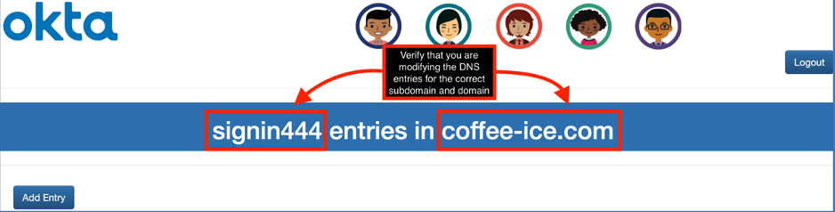
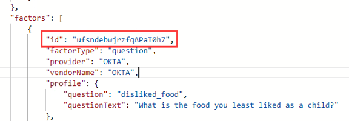
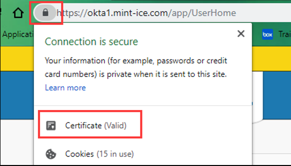

Back to [main page](README.md).

---

# Okta Customer Identity for Developers Lab Guide

Copyright 2022 Okta, Inc. All Rights Reserved.

## Module 4: Table of Contents

  - [Lab 4-1: Configure a Custom Domain](#lab-4-1-configure-a-custom-domain)

  - [Lab 4-2: Implement a Password Policy](#lab-4-2-implement-a-password-policy)

  -  [Lab 4-3: Implement Multi-factor and Sign-on Policies through the Admin Dashboard](#lab-4-3-implement-multi-factor-and-sign-on-policies-through-the-admin-dashboard)

  -  [Lab 4-4: Implement Multi-factor and Sign-on Policies through REST API](#lab-4-4-implement-multi-factor-and-sign-on-policies-through-rest-api)

  -  [Lab 4-5: Verify the Custom URL Domain](#lab-4-5-verify-the-custom-url-domain)


## Lab 4-1: Configure a Custom Domain

🎯 **Objective:**   Configure a custom domain in Okta and configure your DNS to support the custom URL. 

🎬 **Scenario**    Continuing with the white label experience, Okta Ice wants to change the Okta URL to its own domain. In this lab, you will configure Okta and your DNS to change the Okta URL end-users will use. 

⏱️ **Duration:**     20 minutes

---

📝 **Note** In this lab, make sure to use the general Okta account in the DNS, NOT your individual account, or you will not be able to verify.

### Configure a Custom Domain

1.  Log in to your Okta org as `oktatraining`.

2.  Click `Customizations` > `Domain`.

3.  Click `Edit` and then click the `Get started` button.

4.  To locate the fully qualified domain name assigned to you for this class:

    a.  Open the credentials spreadsheet

    b.  Navigate to the `CLOUDFLARE` section

    c.  Locate the `SUBDOMAIN` and `DOMAIN` next to your name in the list

    d.  Your fully qualified domain is `<SUBDOMAIN>.<DOMAIN>`, e.g. `signin###.coffee-ice.com`.

5.  Enter your fully qualified domain name into the `Domain` field in Okta.

6.  Under **Certificate management**, ensure Okta-managed is selected.

7.  Click `Next`.

8.  Okta will now provide you with a `TXT` value and a `CNAME` value.

    a.  The `TXT` value is a `DNS 01` challenge, which is used to prove that you own this domain name. We will enter this `TXT` record in our DNS host so Okta can verify our ownership.

    b.  The `CNAME` value allows us to use our domain as an alias to our Okta org. We will also need to enter this `CNAME` record in our DNS host.

### Configure DNS Host

1.  In a new tab, navigate to the DNS configuration tool at https://oktaice.store/ciam/

2.  Login to the DNS configuration tool:

    a.  Enter your assigned **subdomain** (e.g., signin###)

    b.  Select your assigned **domain** from the drop-down menu

    c.  Enter `oktatraining` for the **username**

    d.  Enter `Tra!nme4321` for the **password**

    e.  Click `Login`

3.  You should see a screen like the one below. Verify that you have logged in to modify the DNS entries for the correct subdomain and domain.

 

4.  When you first log in, there should not be any entries. If there are, delete them.

5.  First, add the `TXT` entry:

    a.  Click `Add Entry`

    b.  In the `Type` section, choose `TXT`

    c.  Switch back to your Okta tab

    d.  Copy the **TXT entry name** (e.g.,`_acme-challenge.signin###.coffee-ice.com`)

    e.  Switch back to the DNS configuration tool

    f.  Paste this text into the `Name` field

    g.  Switch back to your Okta tab

    h.  Copy the **TXT entry content** (a unique value generated by Okta)

    i.  Switch back to the DNS configuration tool

    j.  Paste this text into the `Content` field

    k.  Click `Add`

6.  Now add the CNAME entry:

    a.  In the `Type` section, choose `CNAME`

    b.  Switch back to your Okta tab

    c.  Copy the **CNAME entry name** (e.g., `signin###.coffee-ice.com`)

    d.  Switch back to the DNS configuration tool

    e.  Paste this text into the `Name` field

    f.  Switch back to your Okta tab

    g.  Copy the **TXT entry content** (Your Okta org URL)

    h.  Switch back to the DNS configuration tool

    i.  Paste this text into the `Content` field

    j.  Click `Add`

7.  Verify the entries were added to the DNS configuration.

    a.  Click `Cancel`

    b.  You should now see the two entries you added

8.  You can now log out of the DNS configuration tool and close the tab

### Issue the Okta-Managed Certificate

1.  Navigate back to the Okta tab and click `Next`

2.  Okta will take a moment to verify the DNS 01 challenge

    a.  If verification fails, go back and check that you entered both the TXT and CNAME records correctly

    b.  If verification is successful, Okta will issue a TLS certificate for your custom domain. Click `Finish`.

### ✅ Checkpoint

At this point, you have done the configuration that will allow you to access your Okta org with your custom domain. It can take a few minutes for DNS to update, so we will verify that it works in a subsequent lab.

## Lab 4-2: Implement a Password Policy

🎯 **Objective:**   Create a password policy for Retailer accounts. Generate a temporary password for Kay West. Test password reset.       

🎬 **Scenario**    Okta Ice asked you to test the Sign-In page to ensure that it's able to handle password reset scenarios.  

⏱️ **Duration:**     15 minutes

---

### Create a Password Policy for Retailers

1.  Sign in to Okta as `oktatraining`.

2.  In the Admin console, navigate to `Security` > `Authentication`.

3.  On the **Password** tab, click `Add New Password Policy`.

4.  Configure the password policy as follows:

  |**Field**                | **Value**                                      |
  |-----------------------------|-------------------------------------------|
  |Policy name                  | Retailer Policy                           |
  |Policy description           | Password policy for retailers             |
  |Add group                    | Retailers                                 |

  **Authentication Policies**

  |**Field**                | **Value**                                     |
  |-----------------------------|-------------------------------------------|
  |Applies to               |   Okta                                        |
 
 **Password Settings**
 
  |**Field**                | **Value**                                     |
  |-----------------------------|-------------------------------------------|
  |Minimum length               | 5                                         |
  |Common password check        | <ul><li>- [ ] (UNCHECK) Restrict use of common passwords </li></ul> |
  |Password age                 | <ul><li>- [ ] (UNCHECK) ALL options</li></ul>                      |
  |Lock out                     | <ul><li>- [x] (CHECK) Lockout after `3` unsuccessful attempts</li></ul> <ul><li>- [x] (CHECK) Account is automatically unlocked after `5` minutes</li></ul> |

5.  Click `Create Policy`.

> The **Add Rule** dialog box is displayed.

6.  Configure the Password policy rule as follows:

  |**Field**                    | **Value**                                 |
  |-----------------------------|-------------------------------------------|
  |Rule name                    | Retailer Self Service                     |
  |IF User's IP is              | Anywhere                                  |
  |THEN User can                | <ul><li>- [x] (CHECK) change password</li></ul><ul><li>- [x] (CHECK) perform self-service password reset </li></ul><ul><li>- [x] (CHECK) perform self-service account unlock   </li></ul>                              |

7.  Click `Create Rule`.

### Generate a Temporary Password for Kay West

📝 **Note:**
-   The Temporary Password is typically used by the help desk to help users with logging into Okta.
-   This feature generates a one-time password that's reset right after the user login.
-   For this lab, you use this feature to verify how the Sign-In widget presents the reset password for end users.

1.  Click `Directory` > `People`.

2.  Click `kay.west`.

3.  Click `Reset Password`.

4.  Click `Temporary Password`

5.  Record the temporary password since you will use the temporary password to access Okta in the next task.

6.  **Sign out** of Okta.

### Revert Kay's Password Back to the Original Value

1.  Sign into Okta as `kay.west`, using the temporary password recorded in the previous task.

2.  Follow the instructions on the screen and reset the password to `Tra!nme4321`.

3.  In the Reminder Alert, click `OK`.

4.  **Sign out** of Okta.

## Lab 4-3: Implement Multi-factor and Sign-on Policies through the Admin Dashboard

🎯 **Objective:**   Enable a security question and create a corresponding MFA policy. Test MFA on the Sign-In page.

🎬 **Scenario**    Okta Ice asked you to test the Sign-In page to ensure that it's able to handle MFA and password reset scenarios.

⏱️ **Duration:**     10-15 minutes

---

### Enable MFA

1.  **Sign in** to Okta as `oktatraining`.

2.  In the Admin page, navigate to `Security` > `Multifactor`.

3.  In the list of **Factor Types**, select `Security Question`.

4.  Change the status to active by selecting `Activate`.

### Create an MFA Policy

1.  Click the **Factor Enrollment** tab.

2.  Click `Add Multifactor Policy`.

3.  In the **Add Policy** dialog box, complete the fields as follows:

  |**Field**                | **Value**                                     |
  |-----------------------------|-------------------------------------------|
  |Policy Name                  | Retailer MFA Policy                       |
  |Assign to groups             | Retailers                                 |
  |Effective Factors            | Security Question: Required               |

4.  Click `Create Policy`.

A dialog box should appear. If that does not happen, click `Add Rule`.

5.  Complete the fields as follows:

  |**Field**                    | **Value**                                 |
  |-----------------------------|-------------------------------------------|
  |Rule Name                    | Retailer MFA Rule                         |
  |IF User's IP is              | Anywhere                                  |
  |AND User is accessing        | Okta                                      |
  |THEN Enroll multi-factor     | the first time a user signs in            |

6.  Click `Create Rule`.

7.  **Sign out** of Okta.

### Test the MFA Policy with Okta

1.  Sign into Okta as `kay.west`.
    The Multifactor configuration page should be displayed.

2.  Click `Configure factor`.

3.  Follow the instructions on the screen to register a security
    question and record the answer registered.

📝 **Note** You will use the security question in the future to log in with multi-factor.

5.  **Sign out** of Okta.

6.  Sign back into Okta as `kay.west`.

    🛑 **Pause** and answer the following thought questions:

       - Were you challenged to enter the answer to a security question?
       - Why or why not?

7.  **Sign out** of Okta.

### Create a Group Sign-on Policy

1.  Sign back into Okta as `oktatraining`.

2.  In the Admin page, navigate to `Security` > `Authentication`.

3.  Click the **Sign-on** tab.

4.  Click `Add New Okta Sign-on Policy`.

5.  Complete the fields as follows:

  |**Field**                | **Value**                                     |
  |-----------------------------|-------------------------------------------|
  |Policy Name                  | Retailer Sign On Policy                   |
  |Assign to groups             | Retailers                                 |

6.  Click `Create Policy and Add Rule`.

The `Add Rule` dialog box is displayed.

7.  Complete the fields as follows:

|**Field**                    | **Value**                                 |
|-----------------------------|-------------------------------------------|
|Rule Name                    | Retailer MFA Enforcement Rule             |
|IF User's IP is              | Anywhere                                  |
|AND Authenticates via        | Any                                       |
|THEN Access is               | Allowed                                   |
|Multifactor authentication (MFA) is          | Required                                |
|Users will be prompted for MFA       | At every sign in                             |
|Expire session after user has been idle on Okta for    | 1 Hours                                    |

8.  Click `Create Rule`.

9.  **Sign out** of Okta.

### Test the MFA Policy

1.  Sign into Okta as `kay.west`.

    🛑 **Pause** and answer the following thought questions:

       - Were you challenged to enter the answer to a security question?
       - Why or why not?

2.  **Sign out** of Okta.

### ✅ Checkpoint

At this point, you finished exploring the security policy engine in Okta. Next, we'll build custom customer identity experiences with both
client-side and server-side platform.

## Lab 4-4: Implement Multi-factor and Sign-on Policies through REST API

🎯 **Objective:**  Enroll the question factor using Okta's Authentication API and test the Sign-On policy.          

🎬 **Scenario**    You need to explore how the Authentication API works for MFA.  

⏱️ **Duration:**   10-15 minutes

---

### Install the Authentication API Collection from developer.okta.com

1.  Inside the VM, if it is already running, **close Postman.**

2.  Open a new browser tab and navigate to https://developer.okta.com.

3.  From the side menu, select `REFERENCE`.

4.  Click `Postman Collections`.

5.  In the row for **Authentication**, click `Run in Postman`.

6.  Click `Postman for Windows`.

7.  When prompted, open the Postman app to install the collection.

### Add Additional Member to the Retailer Group

1.  Open a new browser tab and Sign in to Okta as `oktatraining`.

2.  Click `Directory` > `Group`.

3.  Click `Retailers`.

4.  Click `Manage People`.

5.  Add **Igor Dean** to this group.

6.  Click `Save`.

### Make an Authentication API call to Okta

1.  In Postman's left pane, expand `Authentication (Okta API)` and
    then open the `POST Primary Authentication` request.

2.  Click the `Body` tab.

3.  Replace `{{username}}` with `igor.dean@oktaice.com` and `{{password}}` with `Tra!nme4321`.

4.  Click `Send`. Postman will display a response.

5.  Scroll down the response and confirm that you can see the following entry in the JSON response:

```json
"status": "MFA_ENROLL"
```

6.  Verify that the `factorType` is `"question"`, and the factor's `status` is `"NOT_SETUP"`.

7.  Highlight the value for `stateToken`.

8.  Right-click and choose `Set` > `stateToken` from the environment variable list.

### Enroll in Question Factor via API call

1.  In Postman's left pane, expand `Authentication` > `Enroll` and then open the `POST Enroll Question Factor` request.

2.  Click `Body` and note how the `stateToken` is used in the API call.

3.  Update the request body as follows:

```json 
{
  "stateToken": "{{stateToken}}",
  "factorType": "question",
  "provider": "OKTA",
  "profile": {
    "question": "disliked_food",
    "answer": "carrot"
  }
}
```

4.  Click `Send`.

5.  Verify that the status is `SUCCESS`.

### Verify Question Factor via API call

1.  Go back to the `Primary Authentication` tab and click `Send`.

2.  Now you should see that in the response, the status is `MFA_REQUIRED`.

3.  Highlight the value for `stateToken`.

4.  Right-click and choose `Set` > `stateToken` from the environment variable list.

5.  Highlight the value for `id` field of the `factors` object.

6.  Right-click and choose `Set` > `factorId` from the environment variable list.

 

📝 **Note** Make sure you do **NOT** mistakenly use the `id` of the user object.

7.  Expand  `Authentication` > `Verify`, and open the `POST Verify Question Factor` API call.

8.  Verify that `factorId` is sent in the request field.

9.  Click `Body` and note how the `stateToken` is used in the API call.

10. Change the answer to carrot and click `Send`.

11. The result returns `SUCCESS`. And you received the `sessionToken` for Igor Dean.

### Disable the Sign-On Policy

1.  **Sign in** to Okta as `oktatraining`.

2.  In the Admin page, navigate to `Security` > `Authentication`.

3.  Click the **Sign-on** tab.

4.  Click the `Retailer Sign-on Policy`.

5.  Click the Active button and select `Deactivate`.

6.  **Sign out** of Okta.

## Lab 4-5: Verify the Custom URL Domain

🎯 **Objective:**   Verify the Custom URL Domain.

🎬 **Scenario**    Verify the Custom URL Domain created earlier in the module.

⏱️ **Duration:**     10 minutes

⚠️ **Prerequisite:** Completion of [Lab 4-1](#lab-4-1-configure-a-custom-domain).

---

### Verify the Custom URL Domain

**Important:** It can take up to 30 minutes to get the custom domain working at the backend. 

1.  Launch an incognito window and go to 

```html
https://<SUBDOMAIN>.<DOMAIN>/app/UserHome
```

The Okta Sign-In page should be displayed.

2.  From the browser address bar, click the lock icon and review the certificate information.



📝 **Note** Okta uses the certificate you provided during the custom domain configuration to establish the https session.

3.  Sign into Okta as `Kay West`.

You should be redirected to the Okta Home page under your custom domain.

📝 **Note** The custom domain is valid for the User Home console and the Self-Service screens. The custom domain is not used in the admin console.

4.  Sign out of Okta.

---
Back to [main page](README.md).