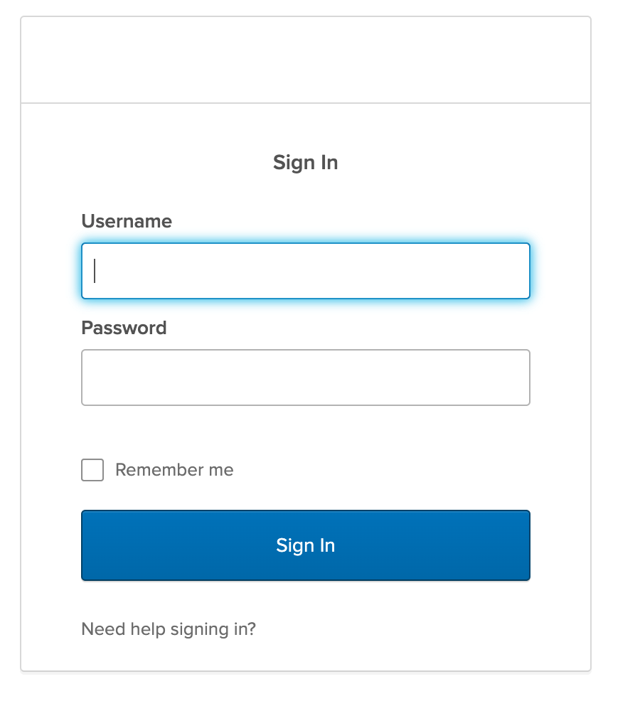
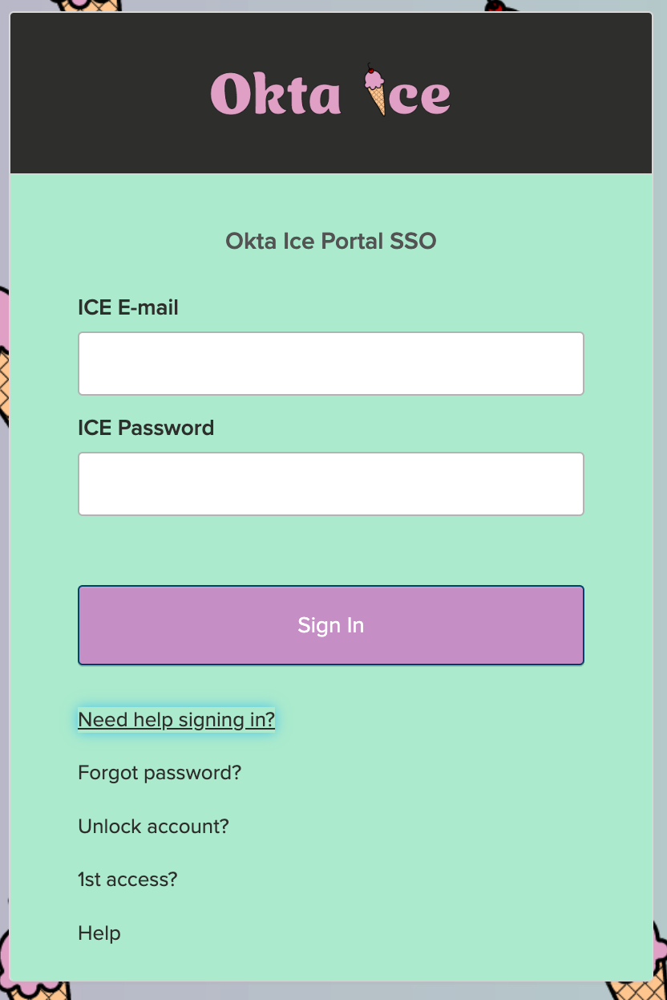

Back to [main page](README.md).

---

# Okta Customer Identity for Developers Lab Guide

Copyright 2022 Okta, Inc. All Rights Reserved.

## Module 5: Table of Contents

  -  [Lab 5-1: Configure a custom Okta-hosted Sign-In page](#lab-5-1-configure-a-custom-okta-hosted-sign-in-page)

  -  [Lab 5-2: Configure the Okta Sign-In Widget](#lab-5-2-configure-the-okta-sign-in-widget)

  -  [Lab 5-3: Customize the Sign-In Widget UI](#lab-5-3-customize-the-sign-in-widget-ui)

  -  [Lab 5-4: Sign-in to App using the OpenID Connect Initiate SSO URL](#lab-5-4-sign-in-to-app-using-the-openid-connect-initiate-sso-url)

  -  [Lab 5-5: Sign-in to App using the App Embed Link](#sign---in-to-app-using-the-app-embed-link)

  -  [Lab 5-6: Explore Auth JS](#lab-5-6-explore-auth-js)

## Lab 5-1: Configure a custom Okta-hosted Sign-In page

🎯 **Objective:**  Configure a custom Okta-hosted Sign-In page.     

🎬 **Scenario**    In this practice, you will customize the Okta sign-in page for a complete white label experience.

⏱️ **Duration:**   20 minutes

⚠️ **Prerequisite:** Completion of Lab [4-1](module4.md#lab-4-1-configure-a-custom-domain) and [4-5](module4.md#lab-4-5-verify-the-custom-url-domain).

---


### Customize the Sign In Page

1.  Access your Okta org as `oktatraining`.

2.  Click `Customizations` > `Sign-in page code editor`.

3.  Copy the contents from the followinf file:

```bash
C:\ClassFiles\platform\osw\ice-signon-html.txt
```

4.  Paste the contents into the HTML section on the Sign In Page code editor, overwriting the default HTML markup.

5.  Click `Save and Publish`.

6.  Sign out of Okta.

### Verify the Results

1.  Launch an incognito window and go to

  ```html
  https://<SUBDOMAIN>.<DOMAIN>
  ```

The Okta Sign-In page with the new layout should be displayed. If not, use the browser refresh button.

2.  Review the Sign In Page layout.

3.  Sign into Okta as `Kay West`.

You should be redirected to the Okta Home page under your custom domain.

### Restore to the Default Domain

1.  Sign into your Okta org as `oktatraining`.

2.  Click `Customizations` > `Domain`.

3.  Click the `Edit` button of the `Custom URL Domain` field.

4.  Click `Remove Domain` and confirm your decision by clicking the `Remove Domain` button.

5.  **Sign-out** of Okta.

## Lab 5-2: Configure the Okta Sign-In Widget

🎯 **Objective:**   Develop your own page using the Okta Sign-In widget.  

🎬 **Scenario**    Okta Ice decided to implement their own sign-in page to Okta.

⏱️ **Duration:**     15 minutes

---
📝 **Note** The solution code for this lab is available on your VM at:

```bash
C:\ClassFiles\platform\osw\login_5-2_complete.html
```

### Launch the HTTP Server

1.  In your VM, launch a **new Command Prompt window** (This can be done by right-clicking on the Command Prompt icon in the task bar, and selecting Command Prompt).

2.  Navigate to the directory holding the Okta Sign-in Widget:

```bash
cd \classfiles\platform\osw
```

3.  Launch the `http-server` utility with the following command:

```bash
http-server -p 8082
```

4.  Launch your browser and access http://localhost:8082/login.html

An HTML page is displayed.

 

### Implement the Sign-In Widget code

📝 **Notes:**

-   In this task, you enable the Okta Sign-In Widget (SIW) by uncommenting lines within the `login.html` page.

-   For your convenience, the code snippet provided with the login page is copied from the [SIW documentation sample code](https://developer.okta.com/docs/guides/archive-embedded-siw/main/).

1.  In your VM, launch **Atom**.

2.  Close any existing projects you have opened in Atom.

3.  Click `File` > `Open Folder`.

4.  Navigate to `C:\ClassFiles\platform`, then select the `osw` folder.

5.  In the left pane, open the **login.html** file.

6.  Make the following changes:

|**Action**                   |  **Line**    | **What it does**                                                     |
|-----------------------------|--------------|----------------------------------------------------------------------|
|Uncomment                    | 9-10            | Access the Okta SIW JavaScript and CSS via CDN |
|Comment                      | 15-17           | No longer needed as we are configuring the widget                    |
|Uncomment                    | 19           | A div element that loads the sign-in widget in page                  |
|Uncomment                    | 24-38        | JavaScript code in page that launches the Sign-In Widget in the page |


7.  Replace the **orgUrl** value to match your unique Okta Ice org.

```javascript
var orgUrl = 'https://oktaice###.oktapreview.com';
```

8.  **Save** the login.html file.

9.  Return to your browser, and refresh the page for http://localhost:8082/login.html.

The Login page with the Sign-In Widget is displayed.

 

10. Observe that the `Remember me` checkbox is available. Optionally, click `Need help signing in?` and check the options available.

📝 **Note** You'll learn to modify and disable these options in future tasks.

11. Sign in as `kay.west@oktaice.com`.

    🛑 **Pause** and answer the following thought questions:

       - Are you logged into Okta?

       - Why or why not?

### Add a Server as a Trusted Origin


📝 **Notes:**

-   Although your code is ready, you cannot log into Okta because the host where the Sign-In Widget is placed (`localhost`) is not
    authorized to make Cross-Origin Resource Sharing (CORS) requests to Okta.

-   CORS is a security feature provided within your browser. Due to CORS, the browser makes JavaScript Async calls (AJAX) only if the origin host is approved by your server.

-   In Okta, you can enable CORS to localhost by adding it as a trusted origin.

1.  In the VM, open a new browser tab in **Chrome**.

2.  Access your Okta org as `oktatraining`.

3.  In the Admin page, navigate to `Security` > `API`.

4.  In the `Trusted Origins` tab, click `Add Origin`.

5.  Provide the following information.

  |**Attribute**  | **Value**|
  |---------------|---------------------------------------------------------|
  |Name           | Okta SIW                                            |
  |Origin URL     | `http://localhost:8082`                                 |
  |CORS           | <ul><li>- [x] (checked)</li></ul>                       |
  |Redirect       | <ul><li>- [ ] (unchecked)</li></ul>                     |

6.  Click `Save`.

7.  **Sign out** of the Okta Admin app.

You're ready to test your integration.

### Test the Okta Sign-In Widget

1.  Return to your browser and access http://localhost:8082/login.html.

2.  In the browser, use the **refresh** button to reload the HTML page.

3.  Sign in as `kay.west@oktaice.com`.

> You are redirected to the Okta home page.

4.  **Sign out** of Okta.

### ✅ Checkpoint

At this point, you installed, configured, and tested the SIW. In the next lab, you will learn to perform the most popular UI customizations available in the SIW.

## Lab 5-3: Customize the Sign-In Widget UI

🎯 **Objective:**  Perform the most popular SIW customizations: rebranding, container, title, help tooltip, help links, and feature customizations.     

🎬 **Scenario**    Okta Ice decided to implement their own sign-in page to Okta. Now that you have the SIW working, it's time to change the look and feel according to Okta Ice preferences. 

⏱️ **Duration:**   15 minutes

---

📝 **Note** The solution code for this lab is available on your VM at:

```bash
C:\ClassFiles\platform\osw\login_5-3_complete.html
```

### Rebrand the Sign-In Widget Page and Login Container

1.  Return to **Atom** and edit the `login.html` file.

2.  To change the login page background, add the following CSS code in the `<head>` section under the comment `<!--Insert Custom CSS under here-->`:

```html
  <style>
    body {
      background-image: url("img/ice-cream-bg.png");
      background-size: cover;
    }
    #okta-sign-in * {
      color: #343633;
    }
    #okta-sign-in .okta-sign-in-header {
      background-color: #343633;
    }
    #okta-sign-in.auth-container.main-container {
      background-color: #B4EDD2;
    }
    #okta-sign-in.auth-container a.link:link {
      color: #343633;
    }
  </style>
```

3.	Examine the CSS selectors:

|**CSS Selector** | **What it does**                                                     |
|-----------------|----------------------------------------------------------------------|
|`body`             | Not specific to the SIW. Selects the body of the page. We use it here to define the page's background.             |
|`#okta-sign-in *` | Selects all elements belonging to the okta-sign-in class. We use it here to set the font color within the SIW.   |    
|`#okta-sign-in.auth-container.main-container` | Selects the main container of the SIW. We use it here to set the background color of the entire SIW.      |
|`#okta-sign-in .okta-sign-in-header` | Selects the top portion of the SIW where the logo is located. We use it here to set it to a different background color than the one defined for the entire SIW to create some contrast.      |
|`#okta-sign-in.auth-container a.link:link` | Selects the link text within the SIW. We use it here to override the default link text color.    |

📝 **Note**: You can read more about customizing the CSS from our [Custom Widget Guide](https://developer.okta.com/docs/guides/custom-widget/main/#modify-the-css). More advanced customization options are available through modifying the Sass source files and building the widget. This requires using the [NPM module](https://github.com/okta/okta-signin-widget/blob/286611d539eaf987de7282416cd6328f837ac3af/docs/classic.md#using-the-npm-module) rather than accessing the Okta SIW assets [via CDN](https://github.com/okta/okta-signin-widget/blob/286611d539eaf987de7282416cd6328f837ac3af/docs/classic.md#using-the-okta-cdn), as we are here.


4.  Update the `OktaSignIn` object to customize some of the SIW properties. This will add a logo and adjust the color of the `Sign In` button on the widget.

```javascript
var oktaSignIn = new OktaSignIn({
  baseUrl: orgUrl, // make sure you add a comma here!
  logo: '/img/ice-logo.png', // add logo image
  logoText: 'Okta Ice', // Text to describe the logo
  brandName: 'Okta Ice', // Shows up in emails
  colors: {
    brand: '#cc99cc' // changes the color of the button
  },
});
```

7.  **Save** the `login.html` file.

8.  Access http://localhost:8082/login.html and confirm that the rebranding and the login form colors have changed.
   


### Customize the Sign-In Widget Configurations

📝 **Note** The solution code for this lab is available on your VM at:

```bash
C:\ClassFiles\platform\osw\login_5-4_complete.html
```

1.  Return to `login.html` in **Atom**.

2. 	Edit the `OktaSignIn` object as follows to define additional properties after the `colors` section:

```javascript
colors: {
        brand: '#cc99cc'
        },
// Additional code goes under here
i18n: {
  'en': {
    'primaryauth.title': 'Okta Ice Portal SSO',
    'primaryauth.username.placeholder': 'ICE E-mail',
    'primaryauth.password.placeholder': 'ICE Password'            
  }
},
helpLinks: {
  help: 'help/call.html',
  forgotPassword: 'help/forgot.html',
  custom: [
    { text: '1st access?', href: 'help/1st-time.html' }
  ]
},
features: {
  rememberMe: false,
  smsRecovery: true,
  selfServiceUnlock: true
}
```

3.	Let’s break down these `OktaSignIn` properties:

|**Property**     | **What it does**                                                              |
|-----------------|-------------------------------------------------------------------------------|
|`i18n`             | Internationalization and Localization. We define the `en` property to customize the English language SIW labels.                                                            |
|`helpLinks`        | Changes the Help, Forgot Password, and Unlock links  |
|`features`         | Updates which features will be available in the UI during sign-in       |


📝  **Note:** To learn more about customizing the SIW properties, check the [Self-hosted SIW Customization Guide](https://developer.okta.com/docs/guides/custom-widget/main/#style-the-self-hosted-sign-in-widget).

4.  **Save** the `login.html` file.

5.  Access http://localhost:8082/login.html and confirm the following changes to the Sign-In Widget:

    a.  The widget **title** has changed from "Sign In" to "Okta Ice Portal SSO".

    b.  The **Remember Me** check box is no longer available.

    c.  The **Need help signing in?** display new options linking to custom pages.



7.  Click `Need help signing in?` > `Unlock Account?` and confirm


8.  *Optionally*, update `login.html` with `smsRecovery: false` and test the Unlock Account feature again.

> The Send SMS button is no longer available.

### ✅ Checkpoint

At this point, you explored popular UI customizations in the Sign-In Widget. In the next practice lab, you will learn to control and pause redirection from the SIW after a successful login. This will allow you to route users to any application after a successful authentication. It will also allow you to extract basic user information (e.g., user login and name) upon authentication.

## Lab 5-4: Sign-in to App using the OpenID Connect Initiate SSO URL

🎯 **Objective:**  Define where the sign-in widget will redirect users to after a successful login.

🎬 **Scenario**    Okta Ice requested that all users should access Promos after a successful login.

⏱️ **Duration:**   15 minutes

⚠️ **Prerequisite:** Completion of [Module 1](module1.md), up to and including Lab 1-4

---

📝 **Note** The solution code for this lab is available on your VM at:

```bash
C:\ClassFiles\platform\osw\login_5-4_complete.html
```

### Enable redirect to the Promos Green app.

1.  In the VM, open a new browser tab in **Chrome**.

2.  Access your Okta org as `oktatraining`.

3.  In the Admin page, navigate to `Security` > `API`.

4.  In the **Trusted Origins** tab, click the `pencil icon` next to **Promos Green**.

5.  Check the box to enable `Redirect`.

6.  Click `Save`.

7.  **Sign out** of the Okta Admin app.

### Configure the Redirection to Promos app in your Sign-In Widget

1.  Return to **Atom**.

2.  Open the `login.html` file.

3.  At the beginning of the `<script>` section, after the declaration of the `orgUrl` variable, declare and set the `redirectUrl` variable:

```javascript
var orgUrl = 'https://oktaice###.oktapreview.com';
// add the following code:
var redirectUrl = 'http://localhost:8081/login';

```

4.  Locate the `if` statement for the `SUCCESS` condition. Change the argument for the redirect URL to be `redirectUrl`.

```javascript
if (res.status == 'SUCCESS') {
  res.session.setCookieAndRedirect(redirectUrl); // change this line
}
```

5.  Save the `login.html` file.

### Test

1.  Back in Chrome, access your application's login page: http://localhost:8082/login.html

2.  In the browser tab, **refresh** the page.

3.  Sign in as `kay.west`.

4.  After the login, you'll be redirected to the **Promos Green** application (launched in [Lab 1-4](#launch-the-promos-app), see instructions there if you stopped the web server).

5.  In the Promos app, click **Logout of App**.

## Lab 5-5: Sign-in to App using the App Embed Link

🎯 **Objective:**  Use the App Embed Link URL to initiate SSO into the Promos Green app.

⏱️ **Duration:**   15 minutes

⚠️ **Prerequisite:** Completion of [Lab 5-1](module5.md/#lab-5-1-configure-a-custom-okta-hosted-sign-in-page)

---

📝 **Note** The solution code for this lab is available on your VM at:

```bash
C:\ClassFiles\platform\osw\login_5-5_complete.html
```

### Obtain the App Embed Link

1.  Access your Okta org as `oktatraining`.

2.  In the Admin console, click `Applications` > `Applications`.

3.  Click on **Promos Green**.

4.  Click the `General` tab.

5.  Click `Edit`.

6.	In the `APPLICATION` section, check `Implicit (hybrid)`. Leave `Authorization Code` checked as well.

📝 **Note**: Even though our application uses PKCE instead of an Implicit flow, we need to check this option in order to get the App Embed Link. You can actually toggle off Implicit flow once you copy the Embed Link in `Step 10`.

7. 	Scroll down to the `LOGIN` section. Change the value for the `Login Initiated by` field to `Either Okta or App`.

8.  Select the `Display application icon to users` check box.

9.  Click `Save`.

10.  Under the App Embed Link, copy the `EMBED LINK`.

11. **Logout** of Okta.

### Configure the to the App Embed Link

1.  Return to **Atom**.

2.  Right click the `login.html` file and click `Duplicate`.

3.  Rename it to `login_embed.html`.

4.  Set the `redirectUrl` variable, replacing `<EMBED_LINK>` with the Promos Green App Embed Link:

```javascript
var redirectUrl = '<EMBED_LINK>'
```

5.  Save the `login_embed.html` file.

### Test

1.  Access the login page: http://localhost:8082/login_embed.html and sign in as `kay.west`.

2.  After the login, you'll be redirected to the Promos Green application.

3.  Close your Browser.

## Lab 5-6: Explore Auth JS

🎯 **Objective:**  Customize a sign in with the Auth JS. Understand the differences of using Auth JS versus Sign-In Widget.   

🎬 **Scenario**    Okta Ice asked you to implement a custom Sign-In in a page that has 3 form fields and implements a custom UI library for mobile devices.  

⏱️ **Duration:**   15 minutes

### Review the Login Material page

1.  Access http://localhost:8082/login_material.html

This page presents a version for the login page using material design.

📝 **Note:** The material design is typically used to improve the user experience accessing from mobile devices. To see how this page is  displayed in a mobile device, you can launch the developer tools in  Google Chrome, activate the device toolbar, and emulate the screen view in a mobile device.


2.  Click `LOGIN`.

Observe that the login form presents 3 fields for login.
In this lab, the user login is determined by concatenating the login with the user company e-mail domain -- for example, using `@oktaice.com` if the user selects `Okta Ice` as `Company`.

### Modify the login code to use Auth JS

📝 **Note:**

-   In this task, you implement the Auth JS by uncommenting lines within the `login_material.html` page.

-   For your convenience, the code snippet provided with the page is based on the [Auth JS documentation](https://developer.okta.com/code/javascript/okta_auth_sdk.html)
    
1.  Return to **Atom** and open the `login_material.html` file.

2.  Optionally, review the `login_material.html` code.

📝 **Note:** This code provides a simple HTML page and uses the [materialize framework](http://materializecss.com/) for UI components.

3.  Uncomment the following lines:

|  **Line**    | **What it does**                                                     |
|--------------|----------------------------------------------------------------------|
| 12           | Downloads the Auth JS code `okta-auth.js.min.js` from CDN            |
| 72           | Login button triggers the `login()` function                         |
| 96-121       |  JavaScript login function that implements the Auth JS library to authenticate users in Okta                |

4.  Comment the `Line 48` to remove the message "It would be awesome if this custom form could log into Okta" message from the page.

5.  Replace the `orgUrl` value to match your unique Okta Ice org. For example:

```javascript
var orgUrl = 'https://oktaiceXXX.oktapreview.com';
```

6.  Set the `redirectUrl` variable with Promos Green App Embed Link:

```javascript
var redirectUrl = '<EMBED_LINK>';
```

6.  **Save** the `login_material.html` file.

### Test the access

1.  Go to your browser, and access http://localhost:8082/login_material.html

2.  Enter `kay.west` as login, select `Okta Ice` as organization, and provide the correct password, and click `Login`.

You should be redirected to Promos Green.
This confirms that the Auth JS is working in conjunction with a custom HTML form.

3.  Close your browser.

### ✅ Checkpoint

At this point, you finished comparing the Sign-In Widget with the Okta Auth JS.

---
Back to [main page](README.md).
