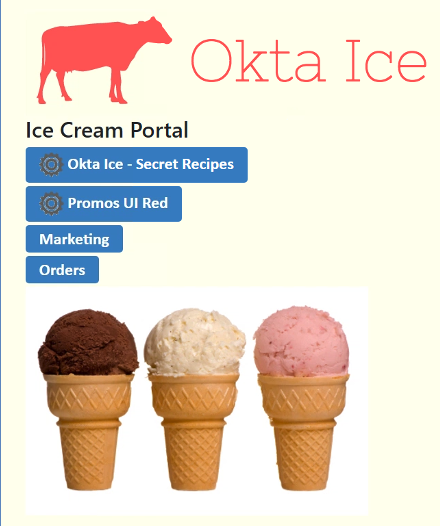

Back to [main page](README.md).

---

# Okta Customer Identity for Developers Lab Guide

Copyright 2022 Okta, Inc. All Rights Reserved.

☕ This module is written in **Java**. You can alternatively complete this lab in [.NET](module6-net.md). Throughout this lab guide, we refer to the [Okta .Java Authentication SDK](https://github.com/okta/okta-auth-java) as simply the Java SDK.

## Module 6: Table of Contents

  -  [Lab 6-1: Setup Authentication with Java SDK](#lab-6-1-setup-authentication-with-java-sdk)

  -  [Lab 6-2: Add Redirect to a Portal Home Page with Java SDK](#lab-6-2-add-redirect-to-a-portal-home-page-with-java-sdk)

  -  [Lab 6-3: Establish a Session with Okta using Java](#lab-6-3-establish-a-session-with-okta-using-java)

  -  [Lab 6-4: Update Service to Retrieve Application Embed Links with Java SDK](#lab-6-4-update-service-to-retrieve-application-embed-links-with-java-sdk)

  -  [Lab 6-5: Enable Single Sign-On to Assigned Applications with Java SDK](#lab-6-5-enable-single-sign-on-to-assigned-applications-with-java-sdk)


## Lab 6-1: Setup Authentication with Java SDK

🎯 **Objective:**  Add display parameters in the View to show that authentication was successful. Define that backing service that will perform the callouts to Okta for authentication. This will be called from the controller later. Update the controller logic to do handle the request to login.         

⏱️ **Duration:**   20 minutes

---

### Update the View for Authentication

1.  In IntelliJ, open the `work-in-progress` > `src` > `main` > `resources` > `templates` > `login.html` file.

2.  Below the "Use an Okta Account to Log In" `h4` tag, add more `h4` tags to display the Session Token from the controller:

```html
<h4>Use an Okta account to log in.</h4>
<h4 style="color:blue" th:if="${Status}" th:text="${Status}"></h4>
 <!--
    👇 Lab 6-1: Add an additional h4 tag below to display the Session Token
 -->
<h4 style="color:blue" th:if="${SessionToken}" th:text="${SessionToken}"></h4> 
<h4 style="color:red" th:if="${ErrorSummary}" th:text="${ErrorSummary}"></h4>
```

3.  **Close** `login.html`.

4.  Click `Build` > `Build Project`.

📝 **Note** If you encounter any errors and need assistance, let your instructor know

### Update the OktaAuthService Interface

1.  Open the `work-in-progress` > `src` > `main` > `java` > `com.okta.examples` > `service` > `OktaAuthService` file.

2.  Import the `OktaAuthRequest` model with the import statement below:

```java
/* 👇 Lab 6-1:
 * import the OktaAuthRequest model
 */
import com.okta.examples.model.OktaAuthRequest;
```

3. Within this interface, we will specify an abstact method called `authenticate()` that will take in an `OktaAuthRequest` object and return an `AuthenticationResponse` if no error is encountered:

```java
/* 👇 Lab 6-1:
 * Declare an abstract method called authentication()
 * @param oktaAuthRequest: an OktaAuthRequest object
 * @return: an AuthenticationResponse object
 * @throws: an AuthenticationException object
 */
AuthenticationResponse authenticate(OktaAuthRequest oktaAuthRequest) throws AuthenticationException;
```
4.  **Close** `OktaAuthService.java`.

### Update the OktaAuthServiceImpl Class

1.  Open the `work-in-progress` > `src` > `main` > `java` > `com.okta.examples` > `service` > `OktaAuthServiceImpl` file.

📝 **Note:**  You may notice that the class heading is underlined indicating an error in the code. This is because the IDE is warning us that we need to implement the abstract method `authenticate()` inherited from the `OktaAuthService` interface. We will do this shortly.

2. Just like we did in the interface, we will import the `OktaAuthRequest` model with the import statement below:

```java
/* 👇 Lab 6-1:
 * import the OktaAuthRequest model
 */
import com.okta.examples.model.OktaAuthRequest;
```

3.  Next, find the `setup()` method in this class. In this method, we need to define our authentication client using the `AuthenticationClients` class from the SDK. The client gets passed our `orgUrl`:

```java
/* 👇 Lab 6-1:
 * Define the authentication client using the AuthenticationClients from the SDK
 */
client = AuthenticationClients.builder().setOrgUrl(orgUrl).build();
```

4.  Since this class implements our `OktaAuthService` interface, we must define the `authenticate()` method:

```java
/* 👇 Lab 6-1:
* TODO: Implement the abstract method authenticate() inherited from the OktaAuthService interface
* @param oktaAuthRequest: an OktaAuthRequest object
* @return: an AuthenticationResponse object
* @throws: an AuthenticationException object
*
* This method will get the username and password captured in the OktaAuthRequest object
* and pass it to our client.
* If no error is encountered, the client returns an AuthenticationResponse.
*/
@Override
public AuthenticationResponse authenticate(OktaAuthRequest oktaAuthRequest) throws AuthenticationException 
{
    return client.authenticate(
        oktaAuthRequest.getUsername(),
        oktaAuthRequest.getPassword(),
        null,
        new EmptyAuthenticationStateHandlerAdapter()
    );
}
```

This method gets the username and password captured by the `OktaAuthRequest` and passes it to our `client`. If no error is encountered, the `client` returns an `AuthenticationResponse`.

5.  **Close** `OktaAuthServiceImpl.java`.

6.  Click `Build` > `Build Project`

📝 **Note** If you encounter any errors and need assistance, let your instructor know.

### Setup dependency injection for the Authentication service

1.  Open the `work-in-progress` > `src` > `main` > `java` > `com.okta.examples` > `controller` > `AccountController` file.

2.  First we will want to define a one-argument constructor for this class. It will set the value of its `oktaAuthService` property:

```java
/* 👇 Lab 6-1:
* TODO: Add a one argument constructor that sets the value of the 
*  oktaAuthService property
*/
public AccountController(OktaAuthService oktaAuthService) {
    this.oktaAuthService = oktaAuthService;
}
```

### Update the Login method to use the Okta Authentication SDK

1.  Scroll down to the `doLogin()` method near the bottom of the class. Add an additional `OktaAuthRequest` parameter to the method signature:

```java
/* 👇 Lab 6-1:
 * TODO: Add an additional OktaAuthRequest parameter to the doLogin method signature
 * It should be the first param and be annotated with @ModelAttribute
 */
public ModelAndView doLogin(
    @ModelAttribute OktaAuthRequest oktaAuthRequest, 
    HttpServletRequest request, 
    HttpServletResponse response) throws IOException
```

Note the use of the [`@ModelAttribute`](https://www.baeldung.com/spring-mvc-and-the-modelattribute-annotation) Spring MVC annotation. 

2. We will use the `oktaAuthRequest` parameter we just added to get a response from the `OktaAuthService`. Then we will store the Status and the Session Token we get back from the response to a `HashMap` named `authResponse`. We will wrap this logic into a `try`/`catch` block in case we encounter an exception:

```java
 try {
   /* 👇 Lab 6-1:
    * TODO: Pass the oktaAuthRequest to the OktaAuthService and extract
    *  the Status and SessionToken from the response. Put this data in authResponse
    */
    AuthenticationResponse oktaAuthResponse = oktaAuthService.authenticate(oktaAuthRequest);
    authResponse.put(
        "Status", 
        "Status: " + oktaAuthResponse.getStatusString());
    authResponse.put("SessionToken", 
                    "Session Token: " +      
                    oktaAuthResponse.getSessionToken());
 }
```

3. If our request does result in an exception, we want to store the error message in `authResponse`. We'll do this in the `catch` block:

```java
catch {
    /* 👇 Lab 6-1:
    * TODO: Store the error message in authResponse if we encounter an exception
    */
    authResponse.put("ErrorSummary", "Error: " + e.getMessage());
}
```

4.  Click `Build` > `Build Project`

📝 **Note** If you encounter any errors and need assistance, let your instructor know.

5.  **Close** `AccountController.java`.

### Test the Log In with Okta Authentication SDK

1.  In IntelliJ, click `Run` > `Debug 'OktaPlatformDemoApplication'`

2.  Wait until the console tab displays the message **Started `OktaPlatformDemoApplication`**.

3.  Leave IntelliJ opened.

4.  Open your browser to: http://localhost:8080

5.  Click  `Login`.

6.  Sign in again as `kay.west@oktaice.com` using a bad password.

The page should refresh with the "Authentication failed" message.

7.  Sign in again as `kay.west@oktaice.com` using valid credentials.

8.  Verify that the status of `SUCCESS` is returned with the session token.

9.  **Close** the web browser running inside the VM and in IntelliJ, click `Run` > `Stop 'OktaPlatformDemoApplication'`

## Lab 6-2: Add Redirect to a Portal Home Page with Java SDK

🎯 **Objective:**  Update the controller to redirect the user to a landing page after successful authentication. 

⏱️ **Duration:**   10 minutes

---

### Examine Landing Page Image

1.  In IntelliJ, navigate to the: `work-in-progress` > `src` > `main` > `resources` > `static` > `img` folder.

2.  Content located in this folder can be referenced as: `/img/<file-name>` in view files.

3.  Double-click the `Ice-Cream-3Flavors.jpg`. This image will be used in the portal view.

5.  Close `Ice-Cream-3Flavors.jpg`.

### Examine Mock Portal Landing Page

1.  Open the `work-in-progress` > `src` > `main` > `resources` > `templates` > `portal.html` file.

2.  Right now, this file just displays a mock of some buttons and the landing page image. We will add more to this file in the following labs.

3.  Close the `portal.html` file.

### Update the AccountController to Redirect User to the Portal Page

1.  Open the `work-in-progress` > `src` > `main` > `java` > `com.okta.examples` > `controller` > `AccountController` file.


2. Scroll down to the `doLogin()` method. This is the method where we set used the Java SDK to implement authentication in [Lab 6-1](#lab-6-1-setup-authentication-with-java-sdk). We now want to redirect the user to our portal page upon successful authentication. In the `try` block, we want to add a `return` statement at the very end that will redirect the user to our portal:

```java
/* 👇 Lab 6-2:
* TODO: Add a return statement that will redirect the user to the portal home upon
*  successful authentication
*
* LATER in 👇 Lab 6-3:
* TODO: Comment out the return statement in the try block
*  Instead, we will initiate a session and associate the userId
*/
    return new ModelAndView("portal", authResponse);
```

3.  **Close** `AccountController.java`.

### Test the Log In with redirection to the Landing Page

1.  Click `Run` > `Debug 'OktaPlatformDemoApplication'`.

2.  Wait until the console tab displays the message **Started `OktaPlatformDemoApplication`**.

3.  Leave IntelliJ opened.

4.  Open a browser window to http://localhost:8080

5.  Click `Login`.

6.  Sign in as `kay.west@oktaice.com`.

7.  Confirm that you landed on the new Portal landing page.

8.  **Close** the web browser and click: `Run` > `Stop 'OktaPlatformDemoApplcation'` in IntelliJ.

## Lab 6-3: Establish a Session with Okta using Java

🎯 **Objective:**  Update the controller to redirect to Okta to establish a session.    

⏱️ **Duration:**   15-20 minutes

---

### Enable SSO to Okta in the AccountController

Instead of redirecting the user to the portal landing page directly, we are going to direct the user to Okta first to establish a session in our Okta domain.

1.  Open the `work-in-progress` > `src` > `main` > `java` > `com.okta.examples` > `controller` > `AccountController` file.

2.  Inside the `doLogin()` method, comment out the `return` statement at the end of the `try` block. This `return` statement redirected the user to the portal landing page directly. Instead, we're going to initiate a session in our Okta domain using the userId that we get back from the `OktaAuthResponse`:

```java
/* Later in 👇 Lab 6-3:
 * TODO: Comment out the return statement in the try block
 *  Instead, we will initiate a session and associate the userId 
 * from the Okta Auth Response with this session.
 */
// return new ModelAndView("portal", authResponse);
HttpSession session = request.getSession(true);
session.setAttribute("userId", oktaAuthResponse.getUser().getId());
```

📝 **Note** Later, you will use the `userId` to fetch the apps available for the user.

3.  To generate the URL string that redirects the browser to the Okta subdomain, passing the session token and the encoded redirect URL back to the app, add the following code on the next line:

```java
/* 👇 Lab 6-3:
 * TODO: Build the URL string for directing the user to our Okta subdomain
 *  This will consist of our orgUrl, the /login/sessionCookieRedirect endpoint,
 *  a query string parameter (token), that gets the session token from the Okta Auth Response,
 *  and another query string parameter (redirectUrl), which gets our portal URL.
 *  Finally, we will send this redirect URL as part of our response. 
 */
String redirectToOktaUrl = orgUrl +  "/login/sessionCookieRedirect";
redirectToOktaUrl += "?token=" +  oktaAuthResponse.getSessionToken();
redirectToOktaUrl +=  "&redirectUrl=http://localhost:8080/portal";
response.sendRedirect(redirectToOktaUrl);
```

4.  **Close** the `AccountController.java` file.

### Setup the Spring Boot host as a Trusted Origin

Your instance of your Spring Boot server needs to be granted access in Okta.

1.  In Chrome, launch a new browser tab and log into your Okta org as `oktatraining`.

2.  In the Admin page, go to `Security` > `API`.

3.  Select `Trusted Origins`.

4.  Click the `Add Origin` button

5.  Provide the information as follows:

|  **Attribute**  | **Value**                    |
|-----------------|------------------------------|
| Name            | Spring Boot Portal           |
| Origin URL      | http://localhost:8080        |
| Redirect        | (CHECKED)                    |

6.  Click **Save**.

7.  **Sign out** of Okta and then **close** that browser tab.

### Test the Log in with SSO to Okta

1.  Click `Run` > `Debug 'OktaPlatformDemoApplication'`

2.  Wait until the console tab displays the message **Started `OktaPlatformDemoApplication`**.

3.  Leave IntelliJ opened.

4.  Navigate to http://localhost:8080 in a browser

5.  Click `Login`.

6.  Sign in as `kay.west@oktaice.com`.

7.  Verify that you land on the new Portal page.

8.  **Close** the browser tab

9.  Click `Run` > `Stop 'OktaPlatformDemoApplication'` in IntelliJ.

## Lab 6-4: Update Service to Retrieve Application Embed Links with Java SDK

🎯 **Objective:**  Build a service to obtain the application embed links for the current user.   

⏱️ **Duration:**   15 minutes

---

### Add the OktaAppLink Model

1.  Next we will be creating a new class called `OktaAppLink`. Objects of this class will represent the application links a user sees when they are authenticated with Okta and land on our portal. There are three properties that will be encapsulated within members of this class: the URL to the app, the URL to the app's logo, and the app's label. We will create this class under our `model` directory:
    a. In IntelliJ, right-click `work-in-progress` > `src` > `main` > `java` > `com.okta.examples` > `model`.
    
    b.  Choose `New` > `Java Class`.
    
    c. Enter `OktaAppLink` for the class name and click `OK`.

2.  We will need to import two classes. The first one is the`OktaAuthRequest` class we created. We will also import the `JsonIgnoreProperties` class from a third party library so that we can ignore JSON properties that aren't pertinent to our use case. Import these two classes at the top of the code:

```java
package com.okta.examples.model;
// 👇 add the following import statements below the package statement
import com.okta.examples.model.OktaAuthRequest;
import com.fasterxml.jackson.annotation.JsonIgnoreProperties;
```

3.  In order to ignore unknown JSON properties at the class level, we will add the annotation `@JsonIgnoreProperties(ignoreUnknown = true)` just before the class header:

```java
@JsonIgnoreProperties(ignoreUnknown = true)
// 👆 add the annotation above the class heading
public class OktaAppLink {...}
```

4. Next we will add the private instance variables that will represent the app's link URL, the URL for the app's logo, and the app's label:

```java
@JsonIgnoreProperties(ignoreUnknown = true)
public class OktaAppLink {
    // 👇 add the private instance variables below the class heading
    private String linkUrl;
    private String logoUrl;
    private String label;
}

```

5.  Now that we have our private instance variables, we need to generate getters and setters for them so we can access and modify their values from external classes. To do this in IntelliJ:

    a. Right-click within the body of the class and choose `Generate...`

    b. Choose `Getter and Setter`.

    c. Select `linkUrl`, `logoUrl` and `label` and click `OK`

### Update the OktaUserService Interface

1.  Open the `work-in-progress` > `src` > `main` > `java` > `com.okta.examples` > `service` > `OktaUserService.java` file.

2.  Import the `OktaAppLink` model we just created:

```java
/* 👇 Lab 6-4:
 * Import the OktaAppLink class
 */
import com.okta.examples.model.OktaAppLink;

```

3.  Now we'll specify an abstract method called `getAppLinks()` that returns a `List` of `OktaAppLink` objects given a `userId` string:

```java
public interface OktaUserService extends OktaBaseService {
    /* 👇 Lab 6-4:
     * TODO: Specify an abstract method called getAppLinks
     * @param String userId
     * @return List<OktaAppLink>
     */
    List<OktaAppLink> getAppLinks(String userId);
}
```

4.  **Close** `OktaUserService.java`.

### Update the OktaUserServiceImpl Class

1.  Open the `work-in-progress` > `src` > `main` > `java` > `com.okta.examples` > `service` > `OktaUserServiceImpl` file.

📝 **Note:**  You may notice that the class heading is underlined indicating an error in the code. This is because the IDE is warning us that we need to implement the abstract method `getAppLinks()` inherited from the `OktaUserService` interface. We will do this shortly.

2.  Again, we will need to import the `OktaAppLink` class we just created:

```java
/* 👇 Lab 6-4:
 * Import the OktaAppLink class
 */
import com.okta.examples.model.OktaAppLink;
```

3.  Since this class implements the `OktaUserService` interface, we need to implement the `getAppLinks()` method. We'll start with just the method signature and an empty method body (`TODO #1`):
```java
/*  Lab 6-4:
* TODO: Implement the abstract method getAppLinks() inherited from OktaUserService
* @param String userId
* @return List<OktaAppLink>
* This method should get and return a list of app links 
* associated with a user, given the userId.
*/
// TODO #1👇:   Define the method signature with an empty method body
@Override
public List<OktaAppLink> getAppLinks(String userId) {

    // TODO #2:   Build the requestURL string

    // TODO #3: Execute a request the requestURL we built. 
    //  Store the result as an InputStream

    // TODO #4: Catch any error that results from our request
    //  Log the error and return null

}
```

4. Now let's move on to the logic. The purpose of this method is to get and return a list `OktaAppLink`s associated with a user, given the `userId`. We will need to request the app links associated with the user using the [`Get User`](https://developer.okta.com/docs/reference/api/users/#get-user) endpoint of the Core Okta API. So our next step `(TODO #2)` is to build a string that represents the URL where we'll send this request. The form will be: `{OktaOrgUrl}/api/v1/users/{userId}/appLinks` 

```java
/*  Lab 6-4:
* TODO: Implement the getAppLinks method inherited from OktaUserService
* @param String userId
* @return List<OktaAppLink>
* This method should get and return a list of app links 
* associated with a user, given the userId.
*/
// TODO #1:   Define the method signature with an empty method body
@Override 
public List<OktaAppLink> getAppLinks(String userId) { 

    // TODO #2👇:   Build the requestURL string
    String requestURL = orgUrl + "/api/v1/users/" + userId + "/appLinks";

    // TODO #3: Execute a request the requestURL we built. 
    //  Store the result as an InputStream and return the mapped data

    // TODO #4: Catch any error that results from our request
    //  Log the error and return null
}
```

5. Next (`TODO #3`), we need to execute a request to this URL and store the returned response. When we issue the request, we need to be sure to pass the appropriate headers. We'll specify `no-cache` in the `Cache-Control` header, we'll pass in our `apiToken` in the `Authorization` header, and we'll specify that our client can accept `application/json` via the `Accept` header. Finally, let's specify that the content that is returned should be returned as `InputStream`. We'll store the result to an `InputStream` variable called `is`. Let's wrap all of this in a `try`/`catch` block in case our request results in an error:

```java
/*  Lab 6-4:
* TODO: Implement the getAppLinks method inherited from OktaUserService
* @param String userId
* @return List<OktaAppLink>
* This method should get and return a list of app links 
* associated with a user, given the userId.
*/
// TODO #1:   Define the method signature with an empty method body
@Override
public List<OktaAppLink> getAppLinks(String userId) {

    // TODO #2:   Build the requestURL string
    String requestURL = orgUrl + "/api/v1/users/" + userId + "/appLinks";

    // TODO #3 👇: Execute a request the requestURL we built. 
    //  Store the result as an InputStream and return the mapped data
    try {
        InputStream is = Request.Get(requestURL) 
            .addHeader("Cache-Control", "no-cache")
            .addHeader("Authorization", "SSWS " + apiToken)
            .addHeader("Accept", "application/json")
            .execute().returnContent().asStream();

    }
     // TODO #4: Catch any error that results from our request
     //  Log the error and return null
    catch(IOException e) {

    }

}
```

6. (Still in `TODO #3`) After we've stored the results to an `InputStream`, we can map the JSON values to a `List` and return this data. This will go at the end of our `try` block:

```java
/*  Lab 6-4:
* TODO: Implement the getAppLinks method inherited from OktaUserService
* @param String userId
* @return List<OktaAppLink>
* This method should get and return a list of app links 
* associated with a user, given the userId.
*/
// TODO #1:   Define the method signature with an empty method body
@Override
public List<OktaAppLink> getAppLinks(String userId) {

    // TODO #2:   Build the requestURL string
    String requestURL = orgUrl + "/api/v1/users/" + userId + "/appLinks"

    // TODO #3: Execute a request the requestURL we built. 
    // 👇 Store the result as an InputStream and return the mapped data
    try {
        InputStream is = Request.Get(requestURL) 
            .addHeader("Cache-Control", "no-cache")
            .addHeader("Authorization", "SSWS " + apiToken)
            .addHeader("Accept", "application/json")
            .execute().returnContent().asStream();

        return mapper.readValue(is, List.class);
    }
     // TODO #4: Catch any error that results from our request
     //  Log the error and return null
    catch(IOException e) {
       

    }

}
```

7. Last (`TODO #4`), we'll need to handle the case when our request results in an error. In this case, we will log an error and return `null`. This will go in our `catch` block:

```java
    // TODO #4👇: Catch any error that results from our request
    //  Log the error and return null
    catch(IOException e) {
        
        logger.error(
            "Unable to get appLinks: {}", 
            e.getMessage(), 
            e
        );
        return null;
    }

```


8.  **Close** `OktaUserServiceImpl.java`.

9.  Click `Build` > `Build Project`.

📝 **Note** If you encounter any errors and need assistance, let your instructor know.

## Lab 6-5: Enable Single Sign-On to Assigned Applications with Java SDK

🎯 **Objective:**  Update the controller to call the new user service. Update the landing page to provide federate access to Promos UI app via OIDC      

⏱️ **Duration:**   20 minutes

---

### Enable SSO to Promos UI Green in the HomeController

1.  In IntelliJ, open the `work-in-progress` > `src` > `main` > `java` > `com.okta.examples` > `controller` > `HomeController` file.

2.  We will need to import the `OktaAppLink` class since we will be getting a user's app links in this controller:

```java
/* 👇 Lab 6-5:
 * Import the OktaAppLink class
 */
import com.okta.examples.model.OktaAppLink;
```

3.  Recall that the `getAppLinks()` method belongs to the `OktaUserService` interface. Since we'll be getting a user's app links in this class, we'll need a reference to an `OktaUserService` instance. Notice that this class has a private instance variable `oktaUserService`. We'll need to create a one-argument constructor that initializes the value of this private instance variable:

```java
/* 👇 Lab 6-5:
 * TODO: Define a one-argument constructor that initializes the value of
 *  the oktaUserService private instance variable
 */
public HomeController(OktaUserService oktaUserService) {
    this.oktaUserService = oktaUserService;
}
```

4.  Move down to the `portal()` method at the bottom of this class. This method takes an `HttpServletRequest` parameter. This request has the `Session` that was initialized by the `AccountController` in [Lab 6-3](#lab-6-3-establish-a-session-with-okta-using-java). We want to retrieve the `userId` from the session in the request and store it as a `String`:

```java
@GetMapping("/portal")
public ModelAndView portal(HttpServletRequest request) {
    ModelAndView mav = new ModelAndView("portal");
    /* 👇 Lab 6-5:
     * TODO: Retrieve the userId from the session stored in the request
     */
     String userId = (String) request.getSession().getAttribute("userId");
```

5.  After we retrieve and store the `userId`, we want to retrieve the user's app links using the `getAppLinks()` method. We'll need to call this method on the reference to our `oktaUserService` object:

```java
/* 👇 Lab 6-5:
 * TODO: Retrieve a list of the user's app links by passing 
 * in the userId to getAppLinks()
 */
 List<OktaAppLink> appLinks = oktaUserService.getAppLinks(userId); 
```

6.  Now we want to check if our `appLinks` data was successfully retrieved (i.e., not null). If the list is not null, we'll add the `appLinks` data to our model. If it is null, we'll add an error to our model:

```java
/* 👇 Lab 6-5:
 * TODO: Verify that the appLinks list isn't null
 *  if it's not null, add it to our model
 *  otherwise, add an error to our model
 */
if (appLinks != null) {
    mav.addObject("apps", appLinks);
} 
else {
    mav.addObject("apps", new ArrayList<>());
    mav.addObject(
        "error", 
        "Unable to retrieve appLinks. Check the logs."
    );
}
```

Note that the last line returns the modified `ModelAndView` object, which will now contain either the user's list of app links or an error.

📝 **Notes:**

-   The list of apps is contained in a JSON array.

-   For this lab there is only one app. If there are several apps, all app links would be returned.

-   Each app has two important pieces of data; the SSO link and the URL for the app logo.

7.  **Close** the `HomeController.java` file.

8.  Click `Build` > `Build Project`.

📝 **Note** If you encounter any errors and need assistance, let your instructor know.

### Enable SSO to Promos UI app in the Portal

The Portal page must be updated include a new link for Promos UI app.

1.  Open the `work-in-progress` > `src` > `main` > `resources` > `templates` > `portal.html` file.

2.  Find the comment after the `<h2>` tag and enter the following `<h4>` tag that will display the error if there is one:

```html
<h2>Ice Cream Portal</h2>
<!--
👇 Lab 6-5: 
TODO: Add an h4 tag that will display the error if there is one
-->
<h4 style="color:red" th:if="${error}" th:text="${error}"></h4>
```

3.  Add the logic to iterate over the list of app links returned from the controller (if there aren't any apps or there was an error, the list will be empty):

```html
<ul class="nav flex-column">
    <!--
    👇 Lab 6-5: 
    TODO: Add logic that will iterate through the apps in the app list
     and display each as a navbutton using the logo, label, and URL
    -->
    <li class="nav-item" th:each="app : ${apps}">
        <a class="navbutton" target="_blank" th:href="${app.linkUrl}">
            
            <span th:text="${app.label}"></span>
        </a>
    </li>
    <!-- 
        👆 end of iterating through app list
    -->
```
4.  **Close** the `portal.html` file.

### Test the Log in with SSO to Promos UI app

1.  Click `Run` > `Debug 'OktaPlatformDemoApplication'`.

2.  Wait until the console tab displays the message **Started `OktaPlatformDemoApplication`**.

3.  Leave IntelliJ opened.

4.  Open a browser window to http://localhost:8080

📝 **Note** If the web browser is already running, verify that you are not currently logged into Promos UI app or Okta.

5.  Sign in as `kay.west@oktaice.com`.

The home page displays all apps assigned to `Kay West`, including the Promos UI Green app.



6.  Click `Promos UI`.
    A new browser tab opens and you should be successfully logged in and the profile page displayed.

7.  **Close** Chrome and in IntelliJ, click `Run` > `Stop 'OktaPlatformDemoApplication'`.

8.  Shut down IntelliJ.

---
Back to [main page](README.md).