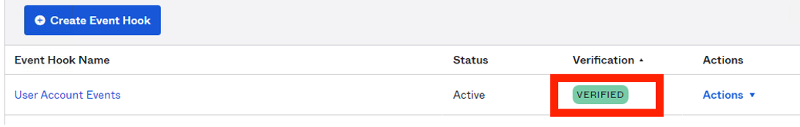
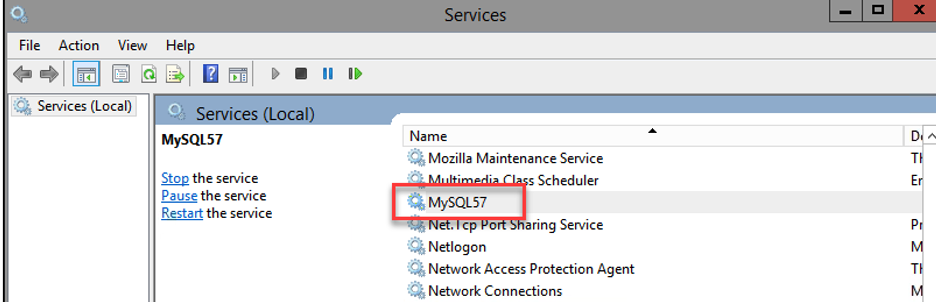
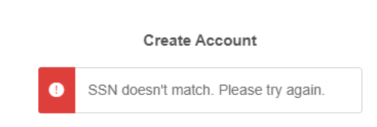

Back to [main page](README.md).

---

# Okta Customer Identity for Developers Lab Guide

Copyright 2022 Okta, Inc. All Rights Reserved.

☕ This module is written in **Java**. You can alternatively complete this lab in [.NET](module7-net.md).

## Module 7: Table of Contents

  -  [Lab 7-1: Send User Accounts Updates using an Event Hook](#lab-7-1-send-user-accounts-updates-using-an-event-hook)

  -  [Lab 7-2: (Optional) Customize User Registration Flow using an Inline Hook](#lab-7-2-optional-customize-user-registration-flow-using-an-inline-hook)

## Lab 7-1: Send User Accounts Updates using an Event Hook

🎯 **Objective:**  Implement an Okta event hook to received updates on user account events

🎬 **Scenario**    Okta Ice would like to get notified whenever a user account is being update, for example, a user changed the password, or a user profile is updated. In many CIAM use cases user updates are required by third party systems, as well as Okta.  Events Hooks provide one method of retrieving the update and feeding that information to other systems.

⏱️ **Duration:**   20 minutes

---

### Open the Project in IntelliJ

1.  Before you begin, **stop any web servers** left running in the VM. To do this, go to the command line windows where the servers are running and press `Ctrl`+`C`. Close these command line windows.

2.  On the **Windows Taskbar**, click the **IntelliJ** icon.

3.  Click `Open`.

4.  Navigate to `C:\` and click the **refresh** button.

5.  Expand `ClassFiles` > `platform` > `hook` > `java` > `hookproject` and select `pom.xml`, and click `OK`.

6.  Click `Open as Project` and wait for the Maven build to complete.

### Explore the RequestConverter Class

1.  Open the `hookproject` > `src` > `main` > `java` > `com.okta.example.hookproject` > `utitliy` > `RequestConverter.java` file.

2.  Examine the `httpToJSON()` method (Starting on `Line 11`).
This method takes in an `HTTPServletRequest` object, parses through it, and returns a `JSONObject` with the request data. You will use this converter for both the Okta Event Hook and Okta Inline Hook.

### Implement the Verification Function

1.  Open the `hookproject` > `src` > `main` > `java` > `com.okta.example.hookproject` > `controller` > `EventHookController.java` file.

2.  Scroll down to the `endpointVerify()` method (around `Line 76`).

3.  Inside this method, set the value of the `String` named `VERIFICATION_HEADER` to `"x-okta-verification-challenge"`. 

```java
/*
 * 👇 Lab 7-1: 
 * TODO: Set the value of VERIFICATION_HEADER to "x-okta-verification-challenge"
 */
final String VERIFICATION_HEADER = "x-okta-verification-challenge";
```

4.  Set value of the `String` named `verification` with the value from the request header:

```java
/*
 * 👇 Lab 7-1:
 * TODO: Set the value of the verification variable to the value from the request header
 * that is keyed on our VERIFICATION_HEADER
 * This will be used in the subsequent lines to set the verification value in the response
 */
String verification = request.getHeader(VERIFICATION_HEADER);
```

### Implement the User Account Events Receiver Function

1.  Scroll back up to the `accountEvents()` method (around `Line 27`).

2. Review the first segment of this method to understand what is happening. Note that this segment makes use of the utility function you examined in the [Explore the RequestConverter Class](#explore-the-requestconverter-class) of this lab.

```java
 /*
  * 👇 Lab 7-1:
  * Review this code segment to understand what is happening.
  * (No modification necessary)
  *
  * 1. First, we use our utility function to parse through the
  * JSON payload of Okta's request to our external service
  * This function will convert the payload into a JSONObject (eventBody)
  *
  * For an example of what this payload looks like see:
  * https://developer.okta.com/docs/concepts/event-hooks/#sample-event-delivery-payload
  *
  * 2. Then we extract the information from the "data" entry in that JSONObject
  * and store it to the variable named data.  Notice that this entry is another JSONObject.
  *
  * 3. Finally, we extract the "events" entry from the data JSONObject.
  * Notice that this is a JSONArray. We will use the events JSONArray
  * to access pertinent String data from the response.
  *
  */
JSONObject eventBody = RequestConverter.httpToJSON(request);
JSONObject data = eventBody.getJSONObject("data");
JSONArray events = (JSONArray) data.get("events");
 /*
  * ☝️ End of review segment
  */
```

3.  Update the `eventType`, `displayMessage` and `eventTime` Strings with values extracted from the HTTP Request so we can pass these values to our `OktaEvent` model and log the information:

```java
 /*
  * 👇 Lab 7-1:
  * TODO: Update the Strings below with values extracted from events JSONArray
  *   retrieved from the HTTP request.
  * We want to store the event type, the display message, and the time event was published.
  * The keys for these entries are eventType, displayMessage, and published.
  *
  * For an example JSON payload of a request from Okta to your external service see:
  * https://developer.okta.com/docs/concepts/event-hooks/#sample-event-delivery-payload
  *
  * We will pass these values to our OktaEvent model and log the details.
  */
  String eventType = events.getJSONObject(0).optString("eventType");
  String displayMessage = events.getJSONObject(0).optString("displayMessage");
  String eventTime = (String)eventBody.get("eventTime");
```
4.  In the next line of code, right-click `OktaEvents` and select `Go To` > `Declaration`.

5.  The `OktaEvents` class is opened. Look at the `toString()` method and examine the format of the event details that will be printed out.

```java
public String toString(){
  String eventDetail = "On "+eventTime +" , a "+ eventType + " event happened to your Org with the following description: "+ displayMessage;
  return eventDetail;
    }
```

  You can close the `OktaEvents` class when you are finished reviewing it.

### Deploy the Hook Project

1.  Expand `hookproject` > `src` > `main` > `java` > `com.okta.example.hookproject`. Right-click `HookprojectApplication` and click `Debug 'HookprojectApplication'`.

2.  Wait until the console tab displays the message **Started `HookprojectApplication`**.

3.  Leave IntelliJ open.

4.  Open a new command prompt inside your VM.

5.  Enter the following command to update ngrok:

```bash
ngrok update
```

6.  Enter the following command to start ngrok:

```bash
ngrok http 8080
```

7.  ngrok will respond with some Forwarding URLs:


8.  **Highlight** the URL that uses `https` and press `Enter` to copy it. This will copy the URI to your Windows clipboard. We will paste this URL into Okta in the next section. 
    
📝 **Note** If you are unable to select text in the command window, right click and click `Select All`. You should then be able to modify your selection.

### Create and Verify the Event Hook

1.  Sign into your Okta org as `okta.service`.

2.  In the Admin console, click `Workflow` > `Event Hooks`.

3.  Click `Create Event Hook`.

4.  Complete the fields as follows:

|  **Field**  | **Value**                    |
|-----------------|------------------------------|
| Name            | User Account Events         |
| URL             | Your ngrok URL, e.g. https://`a59d8d5a.ngrok.io`/event/user-account     |
| Authentication field        | x-api-key                   |
| Authentication secret        | Tra!nme4321                    |
| Subscribe to events       | <ul><li>- [x] User's Okta profile updated</li></ul><ul><li>- [x] Fired when the user's Okta password is reset</li></ul><ul><li>- [x] User's Okta password updated</li></ul>                  |

5.  Click `Save and Continue`.

6.  On the Verify Endpoint Ownership window, click `Verify`.

7.  The User Account Events hook is created and verified:



8.  Go back to the **ngrok command line window**, you should see a new `GET` request:


### Test the Event Hook

1.  In the Admin console, click `Directory` > `People`.

2.  Select `Kay West` from the list.

3.  Click the `Profile` tab then click `Edit`.

4.  Update the `Middle name` field with `O'Reilly` and click `Save`.
Since a user’s Okta profile has been updated, this should have triggered our Event Hook. 

5.  In the **ngrok command line window**, you should see a new `POST` request:


6.  In IntelliJ, the event message similar to the one below is displayed in the console:
```
On 2022-05-01T22:44:19.469Z , a user.account.update_profile event happened to your Org with the following description: Update user profile for Okta
```

7.  In IntelliJ click `Run` > `Stop 'HookprojectApplication'`.

8.  Leave `hookproject` open for the next lab. 

## Lab 7-2: (Optional) Customize User Registration Flow using an Inline Hook

🎯 **Objective:**  Implement an Okta Registration Inline Hook to validate users before self-registering.

🎬 **Scenario**    Okta Ice enabled user self-service registration. But a user needs to enter their SSN number during self-registration. Okta Ice will call a mock third-party API to validate the SSN. If the SSN entered during registration does not match the one returned by the API, the user cannot proceed with the registration. Okta Ice uses the SSN field only for user validation and does not want Okta to store the SSN information. 

User validation, even with self-service registration, can be extremely helpful and can be part of progressive profiling.  In this use case, a third party system has the validating data that Okta does not have at the time of user registration, but can lookup in an external data store.

⏱️ **Duration:**   30 minutes

⚠️ **Prerequisite:** Completion of [Lab 7-1](#lab-7-1-send-user-accounts-updates-using-an-event-hook) and [Lab 3-1](module3.md#lab-3-1-implement-self-service-registration)

---

### Open and Deploy the Employee Project in IntelliJ

1.  In IntelliJ, go to `File` > `Open`.

2.  Navigate to `C:\` and click the **refresh** button.

3.  Expand `ClassFiles` > `platform` > `hook` > `java` > `employee-api` and then select `pom.xml` and click `OK`.

4.  Click `Open as Project`.

5.  Select `New Window` so that you can have both `hookproject` and `employee-api` open at the same time.

6.  Wait for the Maven build to complete.

7.  Open the `employee-api` > `src` > `main` > `resources` > `application.properties` file.

    - Note that the `employee-api` application is configured to run on port `8085` and it connects to a MySQL database named `mydb` to retrieve employee information.

8.  Expand  `employee-api` > `src` > `main` > `java` > `com.oktaice.employeeapi` and then right-click `EmployeeApiApplication` and select `Debug 'EmployeeApiApplication'`.

9.  Wait until the console tab displays the message **Started `EmployeeApiApplication`**.

📝 **Note**: If you get JDBC communication exceptions, manually start your MySQL server by following these steps:
- Click on the **Windows Menu** icon
- Click the **Search** icon
- Search for and open **Services**
- In the Services list, select **MySQL57** and click **Start**. 



10. Leave IntelliJ open and running.

11. From the taskbar of the VM, open **Postman**.

12. Create a new `GET` request to `localhost:8085/employees`

13. Send the request and a list of employees will be returned in the response along with a `200 OK` status code.

### Explore the EmployeeConverter Class

1.  Go back to IntelliJ and go back to the `hookproject` window (the project we opened in 7-1).

2.  Open the `hookproject` > `src` > `main` > `java` > `com.okta.example.hookproject` > `utility` > `EmployeeConverter` file.

3.  Examine the `parseEmployeeInfo()` method.

This method takes in a `String` `requestbody` and parses the JSON data to get the relevant information to create an `EmployeeBasicInfo` object. This includes the employee's username and SSN. You will use this `EmployeeBasicInfo` object to compare information sent by Okta with information retrieved from the `employee-api`, which acts as a third-party service.

### Implement the Function to Retrieve Employee Information

1.  Open the `hookproject` > `src` > `main` > `java` > `com.okta.example.hookproject` > `controller` > `RegistrationInlineHookController` file.

2.  Locate the `getEmployees()` method (around `Line 160`). This method will return a `String` containing information about the employee, given the
    employee's username.

3.  Inside the method, update the `URI` variable so that it contains the following base URI concatenated with the username parameter passed into this method:

```java
/*
 * 👇 Lab 7-2: 
 * TODO: Set the value of URI to 
 *  "http://localhost:8085/employees/search/findByUsername?username=" 
 *   concatenated with the username parameter that is passed into this method
 */
final String URI =  "http://localhost:8085/employees/search/findByUsername?username=" +  username;
```
This URI will return user profile information for a valid, existing username.

4. We need to issue a GET request to this URI to get the profile information associated with the `username`. To achieve this, we are going to make use of Spring's REST Client -- [`RestTemplate`](https://www.baeldung.com/rest-template). We will instantiate a new `RestTemplate` object and pass our URI to to it to issue a `GET` request. We'll store the contents of the response as a `String` in a variable named `employee`: 

```java
/*
 * 👇 Lab 7-2: 
 * TODO: Instantiate a new RestTemplate object that will serve as our REST Client
 *  Pass our URI to the REST client using its getForObject() method
 * See https://www.baeldung.com/rest-template for documentation on RestTemplate
 */
RestTemplate restTemplate = new RestTemplate();        
employee = restTemplate.getForObject(URI, String.class);
```

### Implement the DB lookup functionality

1.  Locate the `accountEvents()` method (`Line 27`). 

2. The first line in this method (`Line 30`) sets up an `OktaHookResponse` object that we will use to structure the response that this method returns (no changes necessary to this line).

```java
// Construct our response, which we will modify as we step through this method
OktaHookResponse response = new OktaHookResponse();
```

3.  Examine the next code segement (beginning `Line 53`) to gain an understand what is happening. Note that this segment makes use of the utility function you examined in the [Explore the RequestConverter Class](#explore-the-requestconverter-class) of this lab.

```java
 /*
  * 👇 Lab 7-2:
  * Review this code segment to understand what is happening.
  * (No modification necessary)
  *
  * 1. First, we use our utility function to parse through the
  * JSON payload of Okta's request to our external service
  * This function will convert the payload into a JSONObject (eventBody)
  *
  * For an example of what this payload looks like see:
  * https://developer.okta.com/docs/concepts/event-hooks/#sample-event-delivery-payload
  *
  * 2. Then we extract the information from the "data" entry in that JSONObject
  * and extract the information from the "userProfile" entry in the "data" object.
  * We store this information to it to the variable named userProfile.  
  * Notice that this entry is another JSONObject.
  *
  * 3. Finally, we extract the "login" entry from the data JSONObject.
  * Notice that this is a String that refers to the username.
  *
  */
JSONObject eventBody = RequestConverter.httpToJSON(request);
JSONObject userProfile = eventBody.getJSONObject("data").getJSONObject("userProfile");
String username = userProfile.getString("login");
 /*
  * ☝️ End of review segment
  */
```

4.  In the first `if` clause that follows on `Line 61`, we verify that we got a valid entry for `ssn` in the part of the JSON payload we stored to `userProfile`. Let's modify the body of this `if` clause to specify what should happen when this is true. First, we want to store the `ssn` as a `String`. Then we can use the `username` and `ssn` to construct an `EmployeeBasicInfo`, which models the information pertaining to an employee:

```java
// Check if we got a valid entry keyed on "ssn" in the JSONObject we stored in userProfile
if (!userProfile.isNull("ssn")) {
  /*
    * 👇 Lab 7-2:
    * TODO: If we have a valid ssn entry, let's store it to a String named ssnFromOkta
    *  Modify the ssnFromOkta variable so that it stores this value.
    * The username and ssnFromOkta are then used to construct a new EmployeeBasicInfo object
    */
    String ssnFromOkta = userProfile.getString("ssn");
    EmployeeBasicInfo newEmployeeFromOkta =  new EmployeeBasicInfo(username, ssnFromOkta);
}
   
```

5. Note that if there was no valid entry for `ssn`  in the payload, the outer `else` clause (around `Line 137`) is reached. In this clause, we create a `Command` that denies registration and an `Error`. Both the `Command` and the `Error` are added to the `response` that is ultimately returned by this method (no modification to this code necessary):

```java
 else { // ssn does not exist in the payload. 
            // construct Command that denies registration
            Commands denyRegNoSSN = new Commands();
            List<Commands> commandsList = new ArrayList<>();
            HashMap<String, String> value = new HashMap<>();
            value.put("registration", "DENY");
            denyRegNoSSN.setValue(value);
            denyRegNoSSN.setType("com.okta.action.update");
            commandsList.add(denyRegNoSSN);

            // construct Error
            Error error = new Error();
            ErrorCauses errorCauses = new ErrorCauses();
            List<ErrorCauses> causesList = new ArrayList<>();
            errorCauses.setErrorSummary("The request payload was not in the expected format. SSN is required.");
            errorCauses.setReason("INVALID_PAYLOAD");
            error.setErrorSummary("Invalid request payload");
            causesList.add(errorCauses);
            error.setErrorCauses(causesList);


            // add Command and Error to the response
            response.setCommands(commandsList);
            response.setError(error);
        }
```
We will take a deeper look at Commands shortly!

6.  Take a look at `Lines 81-83`. In this segment, we get the database information we have stored for this user in our database. We then parse through this information using the utility function you examined in the [Explore the EmployeeConverter Class](#explore-the-employeeconverter-class).

```java
/*
* 👇 Lab 7-2:
* Review this code segment to understand what is happening.
* (No modification necessary)
* 1. First, we retrieve the employee info we have stored in our database using the username
* 2. Then we parse through this information using our utility function.
* This will create a new EmployeeBasicInfo object that stores the username and the SSN
* from the database.
* Last, we store the SSN from the database to a String variable named ssnFromDB
*/
String employeeInfo = getEmployees(newEmployeeFromOkta.getUsername());
EmployeeBasicInfo employeeFromDB = EmployeeConverter.parseEmployeeInfo(employeeInfo);
/*
 * ☝️ End of review segment
 */
```

7. Now we can compare the SSN from Okta to the one we got from our database to see if we have a match! We check for this in the next `if` clause on `Line 88`.

If we have a match, we want to create a new `Commands` object. This type of object is where we can supply commands to Okta. Each element in a `Commands` object consists of a name-value pair:

|  **Property**    | **Description**     | **Data Type**              |
|------------------------|---------------|----------------------------|
| type|One of the [supported commands](https://developer.okta.com/docs/reference/import-hook/#supported-commands)|String|                                      |
| value| The parameter to pass to the command|[value](https://developer.okta.com/docs/reference/import-hook/#value)| 

After the `Commands` object and List of `Commands` are instantiated, we are going to specify a command that will update the user's Okta profile so that Okta will no longer store the user's SSN now that it has been verified. We will then put `Commands` object to our list which will get added to our `response`:

```java
/* 👇 Lab 7-2:
* TODO: Specify a command to add to our Commands object
* The type will be "com.okta.user.profile.update" since we will be updating this Okta user's
* profile.
* The value will set the user's SSN to the empty string so that we no longer store this
* information on Okta now that it has been verified.
* Finally, we will add our Command object to the response
*/
  allowAndResetSSN.setType("com.okta.user.profile.update");
  HashMap<String, String> value = new HashMap<>();
  value.put("ssn", ""); // set ssn to empty string
  allowAndResetSSN.setValue(value);
  commandsList.add(allowAndResetSSN);
  response.setCommands(commandsList);
```


8. However, if we do NOT have a match, we need to specify a different command that will `DENY` registration. We will do this in the inner `else` clause that follows:


```java
/* 👇 Lab 7-2:
* TODO: Specify a command to add to our Commands object
* The type will be "com.okta.action.update" since we 
* The value will be to set registration to "DENY" since the SSN did not match
* Finally, we will add this command to our response
*/
    denyRegNoMatch.setType("com.okta.action.update");
    HashMap<String, String> value = new HashMap<>();
    value.put("registration", "DENY");
    denyRegNoMatch.setValue(value);
    commandsList.add(denyRegNoMatch);
    response.setCommands(commandsList);
```

📝 **Note** We did not have to set `com.okta.action.update` command to `"APPROVE"` in the previous step because `"APPROVE"` is the default value. You only need to alter it if you want to deny the registration.

9.  Finally, we will construct an `Error` to add to the `response`. Under the instantiated  Error object, let's specify that the user could not be registered in the `ErrorSummary`. We will also specify a cause. Last, we will add the `error` to the `response`:

```java
/* 👇 Lab 7-2:
* TODO: Specify in the ErrorSummary that we could not add the registrant
*  Add the error to the payload
*/
errorCauses.setErrorSummary("Unable to add registrant.");
errorCauses.setReason("INVALID_PAYLOAD");
error.setErrorSummary("Invalid request payload");
causesList.add(errorCauses);
error.setErrorCauses(causesList);
response.setError(error);}
```

### Deploy the Hook Project

1.  Click `Run` > `Debug 'HookprojectApplication'`.

2.  Wait until the console tab displays the message **Started `HookprojectApplication`**.

3.  Leave IntelliJ opened.

### Create the Inline Hook

1.  Sign into your Okta org as `okta.service`.

2.  In the Admin console, click `Workflow` > `Inline Hooks`.

3.  Click `Add Inline Hook` > `Registration`.

4.  Complete the fields as follows:

|  **Field**    | **Value**                                                                |
|--------------|---------------------------------------------------------------------------|
| Name           | SSN Validation                                                          |
| URL           | Your ngrok url (e.g. https://`a59d8d5a.ngrok.io`/registration/dblookup)  |
| Authentication field       |    x-api-key                                                |
| Authentication secret       |        Tra!nme4321                                         |


5.  Click `Save`.

### Modify the User Profile Schema to add the SSN Custom Attribute**

1.  In the Admin console, click `Directory` > `Profile Editor`.

2.  From the FILTERS list, select `User (default)`.

3.  Scroll down to the **Attributes** section and click `Add Attribute`.

4.  Complete the fields as follows:

|  **Field**    | **Value**                                           |
|------------------------|--------------------------------------------|
| Display name           | SSN                                        |
| Variable name          | ssn                                        |
| Description            | User's SSN                                 |
| Attribute Length       | Between `1` and `20`                       |
| Attribute required     | (UNCHECKED)                                |

5.  Click `Save`.

6.  In the list of filters on the left, click `Custom`.

7.  Next to the SSN attribute, click the edit button (a `pencil icon`).

8.  Change **User permission** to `Read-Write`.

9.  Click `Save Attribute`.

### Configure the Self-Service Registration Page

1.  In the Admin console, navigate to `Directory` > `Self-Service Registration`.

2.  Click `Edit`.

3.  In the **Account** section, update the `Extension` field and select `SSN Validation`.

4.  In the **Registration Form** section, add the `SSN` field but **do not** check Required.

5.  In the **Post-Registration** section, **uncheck** Activation requirements

6.  Click `Save`.

### Test the Self-Service Registration Page

1.  **Sign out** from Okta.

2.  On the sign-in page, click `Sign up`.

3.  Complete the fields as follows:


|  **Field**             | **Value**                                   |
|------------------------|---------------------------------------------|
| Email                  | astanman@oktaice.com                        |
| Password               | Tra!nme4321                                 |
| First Name             | Amberly                                     |
| Last Name              | Stanman                                     |
| SSN                    | LEAVE BLANK                                 |

  ---

4.  Click `Register`.
You should see the error message "SSN is required" and your registration cannot proceed.


5.  In the ngrok command line window, you should see a new `POST` request to the `/dblookup` endpoint.

6.  In IntelliJ, view the console in `hookproject`. You will see the response sent to Okta displayed:


7.  Change `SSN` to `2223344445` and click `Register`. You should see the error message "SSN doesn't match" and your registration cannot proceed.



8.  Optionally, check the request in the `ngrok` command line window and the response sent to Okta in IntelliJ.

9.  Change `SSN` to `222334444` and click `Register`. Now you should be successful.

10. Optionally, check the request in the `ngrok` command line window and the response sent to Okta in IntelliJ.

11. Setup a recovery question and answer and select a security image.

12. Verify that your new user ends up on the end user dashboard.

13. Click `Amberly` and select `Settings`.

14. On the Personal Information tab, verify that the SSN information you entered is not stored in Okta.

15. **Sign out** of Okta.

16. Go back to IntelliJ and click `Run` > `Stop 'HookprojectApplication'`.

17. Go back to IntelliJ and click `Run` > `Stop 'EmployeeApiApplication'`.

18. Close IntelliJ and the command line window.

---
Back to [main page](README.md).