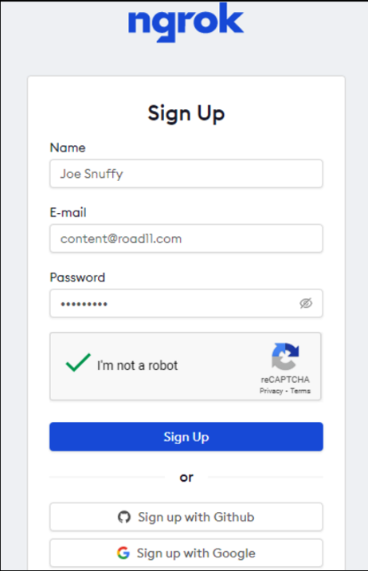
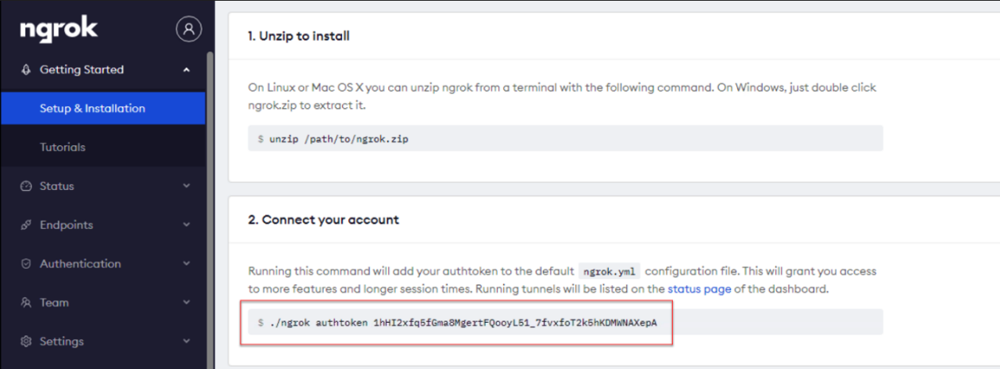
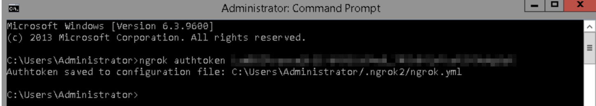
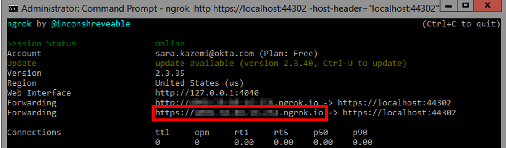
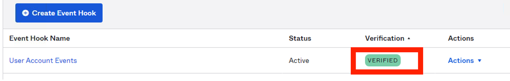
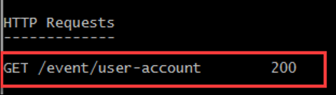
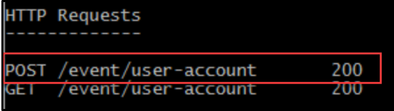
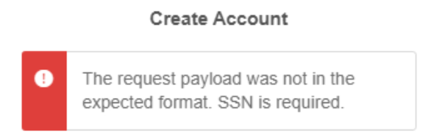
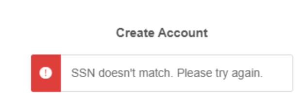

Back to [main page](README.md).

---

# Okta Customer Identity for Developers Lab Guide

Copyright 2022 Okta, Inc. All Rights Reserved.

🟣 This module is written in **.NET**. You can alternatively complete this lab in [Java](module7-java.md).

## Module 7: Table of Contents

  -  [Lab 7-1: Send User Accounts Updates using an Event Hook](#lab-7-1-send-user-accounts-updates-using-an-event-hook)

  -  [Lab 7-2: (Optional) Customize User Registration Flow using an Inline Hook](#lab-7-2-optional-customize-user-registration-flow-using-an-inline-hook)

## Lab 7-1: Send User Accounts Updates using an Event Hook

🎯 **Objective:**  Implement an Okta event hook to received updates on user account events

🎬 **Scenario**    Okta Ice would like to get notified whenever a user account is being update, for example, a user changed the password, or a user profile is updated. In many CIAM use cases user updates are required by third party systems, as well as Okta.  Events Hooks provide one method of retrieving the update and feeding that information to other systems.

⏱️ **Duration:**   20 minutes

---

### Get an Ngrok Authentication Token

1.	Before we begin, stop any web servers left running in the VM. To do this, go to the Command Line Windows where the servers are running and press `Ctrl`+`C`. Close these Command Line Windows.

2.	Open a browser window and navigate to www.ngrok.com.

3.	If you do not already have an ngrok account, click the `Sign Up` button. At the prompt, create a new ngrok account:



4.	ngrok responds by showing you a screen with your authentication token:



5.	Copy and paste this token into a new Notepad text file, `ngrokToken.txt`.

6.	In your VM, open a NEW Command Prompt window (This can be done by right-clicking on the Command Prompt icon in the task bar and selecting Command Prompt)

7.	Enter the following command to update ngrok:

```bash
ngrok update
```

8.	Enter the following command to set your ngrok authentication token (replace `<your-ngrok-auth-token-here>` with your ngrok auth token):

```bash
ngrok authtoken <your-ngrok-auth-token-here>
```

After submitting this command, you should see a message indicating that a `.yml` file has been created:



Leave this window open.

### Open the Project in Visual Studio 2017

1.	On your VM, on the Windows Taskbar, click the Visual Studio 2017 icon.

2.	Click Open a Project or Solution.

3.	Navigate to `C:\ClassFiles\platform\hook\DotNet\NetCoreHooks`, and open the `NetCoreHooks17.sln` file.

4.	If warned about security, click OK to open the solution.

5.	Under Solution Explorer panel, right-click the `NetCoreHooks17` project and select `Properties`.

6.	Under the Debug section, check the `Enable SSL` checkbox.

7.	Save the project, accepting any security certificates, and then close the Properties tab.

### Explore the EventController Class

1.	In the Visual Studio Solution Explorer window:
    
    a. Open the `Controllers` folder.

    b. Double-click on `EventController.cs`.

2.	Notice this controller supports two HTTP actions: `GET`  and `POST`. 

    a. The `Get()` method verifies the hook by accepting a verification header, and sending the value back to Okta wrapped in a `VerificationResponse` object.
    b. The `Post()` method uses the `HttpRequest` object to capture incoming `json`. The method parses the `json` using `Linq-to-Json`. Then an `OktaEvents` object is created and populated with the parsed `json` data.

### Implement the Verification Function

1.	In the `EventController` class, locate the constant declaration, `VERIFICATION_HEADER` (around `Line 29`). Set the value of this constant to the following string:

```c#
/*
* 👇 Lab 7-1: 
* TODO: Set the value of VERIFICATION_HEADER to "x-Okta-Verification-Challenge"
*/
private const string VERIFICATION_HEADER = "x-Okta-Verification-Challenge";
```

2.	Locate the `Get()` function (around `Line 41`) and modify the response variable around `Line 49` so that it refers to a new `VerificationResponse` object.

```c#
/*
* 👇 Lab 7-1: 
*  TODO: Modify the response variable below so it refers to 
*  a new VerificationResponse object
*/
 VerificationResponse response = new VerificationResponse();
```

3. Read through the next lines (`64-73`) in the `Get()` method carefully to understand what is happening. Refer to the comments (lines `51-63`) for a walkthrough.

```c#
/*
 * 👇 Lab 7-1: 
 *  Note what is happening in the following lines (you do NOT need to modify this code):
 *  
 *  First we retrieve the value of the verification request header 
 *  and store it in a variable named verification.
 *  
 *  If it DOES NOT exist (null), we replace the null value with a message 
 *  that it was not found, log a warning, and return BadRequest
 *  
 *  If it DOES exist, we wrap the value in our VerificationObject variable (named response)
 *  and log a success.
 */
string verification = Request.Headers[VERIFICATION_HEADER];
if (verification == null)
{
    verification = "header " + VERIFICATION_HEADER + " was not found in the Request Headers collection";
    _logger.LogWarning($"Event EndpointVerify BadRequest will be returned. {verification}");
    return BadRequest(verification);
}
response.Verification = verification;
Debug.WriteLine("Verification: \n" + verification);
_logger.LogDebug($"Event EndpointVerify suceeded: {response.Verification}");
```

4.	At the end of our `Get()` method, we need to return a response status code of `200 OK` along with the `VerificationResponse` object. Modify `Line 78` so that the `Ok()` method gets passed the `VerificationResponse` object:

```c#
/* 👇 Lab 7-1: 
 * TODO: Pass in the VerificationResponse object (response) to the Ok() method
 */
return Ok(response); // return OK if verification request header returned a value
```

### Implement the Post (user-events) Function

1.	In the Solution Explorer panel, navigate to the `json` folder and open `AccountEvents.json`. This is a sample Event Delivery payload of a request from Okta. This illustrates the format of the payload sent to your external service that will be sent during a `POST` request. Close this file when you are done reviewing it.

2.	Back in `EventController.cs`, scroll down to the `Post()` method (around `Line 85`). 

3.	After the `OktaEvents` object gets instantiated on `Line 101`, we need to grab the relevant values from our parsed json (stored in `desiredEvent`) and assign those values to properties in our `OktaEvents` object:

```c#
/* 👇 Lab 7-1: 
 * TODO: Get Parsed JSON stored in desiredEvent and assign
 * these values to oktaEvents properties
 */
oktaEvents.EventType = desiredEvent["eventType"].ToString();
oktaEvents.DisplayMessage = desiredEvent["displayMessage"].ToString();
oktaEvents.EventTime = desiredEvent["published"].ToString();
```

Note that the `OktaEvents` object is returned by this method.

4.	In the Solution Explorer panel, navigate to the model folder. Open `OktaEvents.cs`. Examine the overridden `ToString()` method. This is the format of the string that will printed to the log file upon successful execution.

### Execute the Hook Project

1.	Run the `NetCoreHooks` application by clicking on the `IIS Express` button in the Visual Studio toolbar.
 
2.	A browser window will open with a list of existing registrants along with their fictional SSNs:

```
Hooks Registrant Test Data - SSNs:

Laura Mipsum : 333-33-3333
Hannibal Smith : 123-45-6789
Jane Zielinski : 987-65-4321
Hank Aaron : 444-44-4444
Slick Salesman : 555-55-5555
Quinn Morelli : 222-22-2222
Javier Lopez : 777-77-7777
```

3.	Make note of the **port number** in the address bar (e.g., `44370`. Your port number may vary). This will be used in the next step.

### Execute ngrok from your Command Window

1.	Return to your ngrok command window from the first step. Execute the following command, replacing `<PORT-NUMBER>` with the value you noted in the previous step.:

```bash
ngrok http https://localhost:<PORT-NUMBER> -host-header="localhost:<PORT-NUMBER>"
```

2.	ngrok will respond with some Forwarding URLs: 



3.	Highlight the URL that uses `https` and press `Enter` to copy it. This will copy the URI to your Windows clipboard. We will paste this URL into Okta in the next section. 

📝 **Note**:  If you are unable to select text in the command window, right click and click `Select All`. You should then be able to modify your selection.

### Create and Verify the Event Hook

1.	Log in to your Okta org as `okta.service`.

2.	In the Admin console, click `Workflow` > `Event Hooks`.

3.	Click `Create Event Hook`.

4.	Complete the fields as follows:

|  **Field**  | **Value**                    |
|-----------------|------------------------------|
| Name            | User Account Events         |
| URL             | Your ngrok URL, e.g. https://`a59d8d5a.ngrok.io`/event/user-account     |
| Authentication field        | x-api-key                   |
| Authentication secret        | Tra!nme4321                    |
| Subscribe to events       | <ul><li>- [x] User's Okta profile updated</li></ul><ul><li>- [x] Fired when the user's Okta password is reset</li></ul><ul><li>- [x] User's Okta password updated</li></ul>  

5.  Click `Save and Continue`.

6.  On the Verify Endpoint Ownership window, click `Verify`.

7.  The User Account Events hook is created and verified:



8.  Go back to the **ngrok command line window**, you should see a new `GET` request:



### Test the Event Hook

1.  In the Admin console, click `Directory` > `People`.

2.  Select `Kay West` from the list.

3.  Click the `Profile` tab then click `Edit`.

4.  Update the `Middle name` field with `Jackson` and click `Save`.
Since a user’s Okta profile has been updated, this should have triggered our Event Hook. 

5.  In the **ngrok command line window**, you should see a new `POST` request:




5.  In the **ngrok command line window**, you should see a new `POST` request:


6.  In Visual Studio, go to the Solution Explorer and navigate to the logs folder in the current project. Open the log file that corresponds to today’s date. The last entry in the log should look something like:

```
On 2022-05-01T22:44:19.469Z , a user.account.update_profile event happened to your Org with the following description: Update user profile for Okta
```

7.	Click the `Stop Debugging` button (or press `Shift` + `F5`) but leave the ngrok command window open. You’ll need it for the next exercise.


## Lab 7-2: (Optional) Customize User Registration Flow using an Inline Hook

🎯 **Objective:**  Implement an Okta Registration Inline Hook to validate users before self-registering.

🎬 **Scenario**    Okta Ice enabled user self-service registration. But a user needs to enter their SSN number during self-registration. Okta Ice will call a mock third-party API to validate the SSN. If the SSN entered during registration does not match the one returned by the API, the user cannot proceed with the registration. Okta Ice uses the SSN field only for user validation and does not want Okta to store the SSN information. 

User validation, even with self-service registration, can be extremely helpful and can be part of progressive profiling.  In this use case, a third party system has the validating data that Okta does not have at the time of user registration, but can lookup in an external data store.

⏱️ **Duration:**   30 minutes

⚠️ **Prerequisite:** Completion of [Lab 7-1](#lab-7-1-send-user-accounts-updates-using-an-event-hook) and [Lab 3-1](module3.md#lab-3-1-implement-self-service-registration)

---

### Open and Deploy the Employee Project in Visual Studio

1.	If Visual Studio is not currently open from the previous exercise, click the `Visual Studio 2017` icon in the Windows Task Bar.

2.	Click `Open Project or Solution`.

3.	Navigate to `C:\Classfiles\platform\hook\DotNet\NetCoreHooks`, and double-click the `NetCoreHooks17.sln` file. Visual Studio will open the `NetCoreHooks` project.

### Explore the `RegistrantController` class

1.	From solution explorer, navigate to `Json/CustomerRegistration.json`. This is the format of the JSON payload that Okta will send to your `RegistrantController`.

2.	From Solution Explorer, open the `Controllers/RegistrantController` file.

3.	Scroll down to the `VerifyRegistrantSSNByUserName()` method (around `Line 44`).

4. The first line in this method (`Line 48`) sets up an `OktaHookResponse` object that we will use to structure the response that this method returns (no changes necessary to this line).

```c#
// Construct our response, which we will modify as we step through this method
OktaHookResponse response = new OktaHookResponse();
```

5. Examine the next code segement (beginning `Line 72`) to gain an understand what is happening. 

```c#
/*
* 👇 Lab 7-2:
* Review this code segment to understand what is happening.
* (No modification necessary)
*
* 1. First we read the characters from the request body asynchronously 
* until the end and store it as a single string.
* 
* 2. Then we check if the request body is valid (not null)
* 
* 3. If the request body is valid, we parse the JSON and convert it to a JObject
*
* 4. Then we extract the information from the "data" entry in that JObject
* and extract the information from the "userProfile" entry in the "data" object.
* We store this information to it to the variable named userProfile.  
* Notice that this entry is another JObject.
* 
* 5. Finally, we extract the "login" entry from the data JObject.
* Notice that this is a string that refers to the username.
*
*/
var reader = new StreamReader(Request.Body);
var payLoad = await reader.ReadToEndAsync();
Debug.WriteLine($"payLoad received: \n{payLoad}");
if (payLoad != null) //make sure you have a valid payload
{  
    var parsedJson = JObject.Parse(payLoad);
    JObject userProfile = (JObject)parsedJson
        .SelectToken("data")
        .SelectToken("userProfile");
    string userName = userProfile["login"].ToString();
/*
* ☝️ End of review segment
*/
```

### Implement coding changes
1.	In the first `if` clause that follows on `Line 88`, we verify that we got a valid entry for `ssn` in the part of the JSON payload we stored to `userProfile`. Let's modify the body of this `if` clause to specify what should happen when this is true. We want to store the `ssn` as a `String`, ensuring that we ignore any dashes the user may have entered:

```c#
/* 👇 Lab 7-2: 
 * TODO: Modify the ssnFromOkta variable so that it
 * stores the extracted SSN value from userProfile
 */
ssnFromOkta = userProfile["ssn"].ToString();
ssnFromOkta = ssnFromOkta.Replace("-","");
```

2. Now let’s get the username from the user profile and assign the value to our existing String variable named `userName`:

```c#
/* 👇 Lab 7-2: 
 * TODO: Now extract the username from the userProfile
 * and save it to the String variable named userName
 */
userName = userProfile["login"].ToString();
```

3.	We now want to extract the SSN value from the user profile and assign the value to our existing variable named `ssnFromOkta` (`Line 80`):

```c#
/* 👇 Lab 7-2: 
 * TODO: Modify the ssnFromOkta variable so that it
 * stores the extracted SSN value from userProfile
 */
ssnFromOkta = userProfile["ssn"].ToString();
ssnFromOkta = ssnFromOkta.Replace("-","");
```

4. Note that if there was no valid entry for `ssn`  in the payload, the outer `else` clause (around `Line 167`) is reached. In this clause, we create a `Command` that denies registration and an `Error`. Both the `Command` and the `Error` are added to the `response` that is ultimately returned by this method (no modification to this code necessary):

```c#
else // ssn key does not exist in the payload.        
{
    // construct Command that denies registration
    Command denyRegNoSSN = new Command();
    Dictionary<String, String> value = new Dictionary<string, string>
    {
        { "registration", "DENY" }
    };
    denyRegNoSSN.value = value;
    denyRegNoSSN.type = "com.okta.action.update";

    // construct Error
    Error error = new Error();
    ErrorCause errorCauses = new ErrorCause();
    List<ErrorCause> causesList = new List<ErrorCause> {};
    errorCauses.ErrorSummary = "The request payload was not in the expected format. SSN is required.";
    errorCauses.Reason = "INVALID_PAYLOAD";
    error.ErrorSummary = "Unable to add registrant";

    // add Command and Error to the response
    response.commands.Add(denyRegNoSSN);
    response.Error = error;
    return Ok(response);
}
```

We will take a deeper look at Commands shortly!

5. Take a look at `Lines 99-111`. In this segment, we get the database information we have stored for this user in our database. This data gets mapped to a RegistrantDTO object. We can access the SSN we got for the registrant by accessing this object's SSN property (e.g., `RegistrantDTO.SSN`)

```c#
/*
* 👇 Lab 7-2:
* Review this code segment to understand what is happening.
* (No modification necessary)
* 1. First, we retrieve the employee info we have stored in our database using the username
* 2. Then we map this information to a RegistrantDTO object so we can access its properties
* (e.g., RegistrantDTO.SSN will get the ssn associated with the registrant)
*/
var Registrant = await _simulatedRemoteDBComponent.FindByUserName(userName);
var RegistrantDTO = _mapper.Map<RegistrantDTO>(Registrant);
/*
* ☝️ End of review segment
*/
```

6. Now we can compare the SSN from Okta to the one we got from our database to see if we have a match! We check for this in the next `if` clause on `Line 114`.

If we have a match, we want to create a new `Commands` object. This type of object is where we can supply commands to Okta. Each element in a `Commands` object consists of a name-value pair:

|  **Property**    | **Description**     | **Data Type**              |
|------------------------|---------------|----------------------------|
| type|One of the [supported commands](https://developer.okta.com/docs/reference/import-hook/#supported-commands)|String|                                      |
| value| The parameter to pass to the command|[value](https://developer.okta.com/docs/reference/import-hook/#value)| 

After the `Commands` object and List of `Commands` are instantiated, we are going to specify a command that will update the user's Okta profile so that Okta will no longer store the user's SSN now that it has been verified. We will then put `Commands` object to our list which will get added to our `response`:

```c#
/* 👇 Lab 7-2:
* TODO: Specify a command to add to our Commands object
* The type will be "com.okta.user.profile.update" since we will be updating this Okta user's
* profile.
* The value will set the user's SSN to the empty string so that we no longer store this
* information on Okta now that it has been verified.
* Finally, we will add our Command object to the response
*/
  allowAndResetSSN.type = "com.okta.user.profile.update";
  Dictionary<String, String> value = new Dictionary<string, string>
    {
        { "ssn", "" }
    };
  denyRegNoSSN.value = value;
  response.commands.Add(allowAndResetSSN);
```

7. However, if we do NOT have a match, we need to specify a different command that will `DENY` registration. We will do this in the inner `else` clause that follows:


```c#
/* 👇 Lab 7-2:
* TODO: Specify a command to add to our Commands object
* The type will be "com.okta.action.update" since we 
* The value will be to set registration to "DENY" since the SSN did not match
* Finally, we will add this command to our response
*/
Dictionary<String, String> value = new Dictionary<string, string>
{
    { "registration", "DENY" }
};
denyRegNoMatch.value = value;
denyRegNoMatch.type = "com.okta.action.update";
response.commands.Add(denyRegNoMatch)
```

📝 **Note** We did not have to set `com.okta.action.update` command to `"APPROVE"` in the previous step because `"APPROVE"` is the default value. You only need to alter it if you want to deny the registration.

8. Finally, we will construct an `Error` to add to the `response`. Under the instantiated  Error object, let's specify that the user could not be registered in the `ErrorSummary`. We will also specify a cause. Last, we will add the `error` to the `response`:

```c#
/* 👇 Lab 7-2:
* TODO: Specify in the ErrorSummary that we could not add the registrant
*  Add the error to the payload
*/
errorCauses.ErrorSummary = "Unable to add registrant";
error.ErrorSummary = "Unable to add registrant";
errorCauses.Reason = "INVALID_PAYLOAD";
error.ErrorSummary = "Unable to add registrant";
response.Error = error;
```


Notice that if we did NOT get valid data from our database for the user, we DENY registration and return an error in the response (`Lines 115-141`). 

```c#
else // we didn't have any info for that user stored in our database (got null)
{
    // So, we can't verify the SSN!
    // Deny registration. Create new Error and return it in a response.
    response = new OktaHookResponse();
    Dictionary<String, String> dict = new Dictionary<string, string>
    {
        { "registration", "DENY" }
    };

    Command command = new Command();
    command.type = "com.okta.action.update";
    command.value = dict;
    response.commands.Add(command);
    Error error = new Error();
    error.ErrorSummary = "Unable to add registrant";
    error.ErrorCauses = new List<ErrorCause>
    {
        new ErrorCause{ErrorSummary = "Unable to convert Registrant to RegistrantDTO",
            Domain="end-user",
            Location="data.UserProfile.login",
            Reason="Unable to convert Registrant"}
    };
    response.Error = error;
    Debug.WriteLine("unable to convert Registrant to RegistrantDTO");
    return Ok(error);
}
```

5.	On Line `146` we check if the `SSN` received from Okta matches the `SSN` from the database. If it does, we create a new `Command` object. This type of object is where we can supply commands to Okta. Each element in a `Command` object consists of a name-value pair:

|  **Property**    | **Description**     | **Data Type**              |
|------------------------|---------------|----------------------------|
| type|One of the [supported commands](https://developer.okta.com/docs/reference/import-hook/#supported-commands)|String|                                      |
| value| The parameter to pass to the command|[value](https://developer.okta.com/docs/reference/import-hook/#value)| 

Under `Line 150` where the `Command` object is instantiated, we are going to specify a command that will update the user's Okta profile so that Okta will no longer store the user's SSN now that it has been verified. We will then add the `Command` object to our `response`:

```c#
/* 👇 Lab 7-2: 
* TODO: Construct a command to add to our Command object
* The type will be "com.okta.user.profile.update" since we will be updating this Okta user's 
* profile.  
* The value will set the user's SSN to the empty string so that we no longer store this 
* information on Okta now that it has been verified.
* Finally, we will add our Command object to the response
*/
Dictionary<String, String> emptySSN = new Dictionary<string, string>
{
    { "ssn", String.Empty }
};
command.type = "com.okta.user.profile.update";
command.value = emptySSN;
response.commands.Add(command);
```

6.	If the `SSN`s do NOT match, we will construct command that will tell Okta to deny registration. We will do this in the inner `else` clause after the `Command` object is instantiated. We will then add the `Command` object to the `response`:

```c#
 /* 👇 Lab 7-2: 
  * TODO: Construct a command to add to our Command object
  * The type will be "com.okta.action.update" which is an action 
  * we use when specifying whether to create a new Okta user when importing
  * users or matching them against existing Okta users.
  * The value DENY registration since the SSNs did not match.
  * 
  * Finally, we will add our Command object to the response
  */
  Dictionary<String, String> denyRegistration = new Dictionary<string, string>
  {
      { "registration", "DENY" }
  };
  command.type = "com.okta.action.update";
  command.value = denyRegistration;
  response.commands.Add(command);
```

7. Finally, we will construct an `Error` to add to the `response`. :Under the instantiated of the Error object (`Line 190`), let's specify that the user could not be registered in the `ErrorSummary`. We will leave the `ErrorCause` blank. 

```c#
/* 👇 Lab 7-2: 
 * TODO: Specify in the ErrorSummary that we could not add the registrant
 * Leave the ErrorCauses empty
 */
error.ErrorSummary = "Unable to add registrant";
error.ErrorCauses = new List<ErrorCause>{};
```
### Run the Hook Project
1.	From the Visual Studio toolbar, click the `IIS Express` button to run the `NetCoreHooks` project.

2.	A web page will open displaying the fictional names and SSNs we will use to test Okta’s Inline Hook capability.

```
Hooks Registrant Test Data - SSNs:

Laura Mipsum : 333-33-3333
Hannibal Smith : 123-45-6789
Jane Zielinski : 987-65-4321
Hank Aaron : 444-44-4444
Slick Salesman : 555-55-5555
Quinn Morelli : 222-22-2222
Javier Lopez : 777-77-7777
```

3.	Minimize this browser window but leave Visual Studio open.


### Create the Inline Hook

1.  Sign into your Okta org as `okta.service`.

2.  In the Admin console, click `Workflow` > `Inline Hooks`.

3.  Click `Add Inline Hook` > `Registration`.

4.  Complete the fields as follows:

|  **Field**    | **Value**                                                                |
|--------------|---------------------------------------------------------------------------|
| Name           | SSN Validation                                                          |
| URL           | Your ngrok url (e.g. https://`a59d8d5a.ngrok.io`/registration/dblookup)  |
| Authentication field       |    x-api-key                                                |
| Authentication secret       |        Tra!nme4321                                         |


5.  Click `Save`.

### Modify the User Profile Schema to add the SSN Custom Attribute

1.  In the Admin console, click `Directory` > `Profile Editor`.

2.  From the FILTERS list, select `User (default)`.

3.  Scroll down to the **Attributes** section and click `Add Attribute`.

4.  Complete the fields as follows:

|  **Field**    | **Value**                                           |
|------------------------|--------------------------------------------|
| Display name           | SSN                                        |
| Variable name          | ssn                                        |
| Description            | User's SSN                                 |
| Attribute Length       | Between `1` and `20`                       |
| Attribute required     | (UNCHECKED)                                |

5.  Click `Save`.

6.  In the list of filters on the left, click `Custom`.

7.  Next to the SSN attribute, click the edit button (a `pencil icon`).

8.  Change **User permission** to `Read-Write`.

9.  Click `Save Attribute`.

### Configure the Self-Service Registration Page

1.  In the Admin console, navigate to `Directory` > `Self-Service Registration`.

2.  Click `Edit`.

3.  In the **Account** section, update the `Extension` field and select `SSN Validation`.

4.  In the **Registration Form** section, add the `SSN` field but **do not** check Required.

5.  In the **Post-Registration** section, **uncheck** Activation requirements

6.  Click `Save`.

### Test the Self-Service Registration Page

1.  **Sign out** from Okta.

2.  On the sign-in page, click `Sign up`.

3.  Complete the fields as follows:


|  **Field**             | **Value**                                   |
|------------------------|---------------------------------------------|
| Email                  | laura.mipsum@oktaice.com               |
| Password               | Tra!nme4321                                 |
| First Name             | Laura                                     |
| Last Name              | Mipsum                                     |
| SSN                    | LEAVE BLANK                                 |

  ---

4.  Click `Register`.
You should see the error message "SSN is required" and your registration cannot proceed.



5.  In the ngrok command line window, you should see a new `POST` request to the `/dblookup` endpoint.

6.  Change `SSN` to `2223344445` and click `Register`. You should see the error message "SSN doesn't match" and your registration cannot proceed.



7.  Optionally, check the request in the `ngrok` command line window and/or the log file in Visual Studio under the `/logs` folder.

8.  Change `SSN` to `333333333` and click `Register`. Now you should be successful.

9. Optionally, check the request in the `ngrok` command line window and/or the log file in Visual Studio under the `/logs` folder.

10. Setup a recovery question and answer and select a security image.

11. Verify that your new user ends up on the end user dashboard.

12. Click `Laura` and select `Settings`.

13. On the Personal Information tab, verify that the SSN information you entered is not stored in Okta.

14. **Sign out** of Okta.

14.	Go back to Visual Studio and click the `stop` button, which will automatically close the browser window it started. 

15.	**Close** Visual Studio.

---
Back to [main page](README.md).