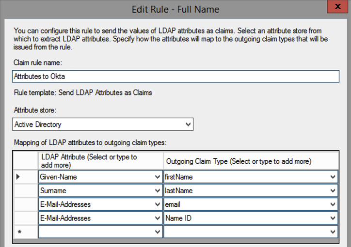

Back to [main page](README.md).

---

# Okta Customer Identity for Developers Lab Guide

Copyright 2022 Okta, Inc. All Rights Reserved.

## Module 8: Table of Contents

-  [Lab 8-1: Configure Inbound Federation with AD FS as SAML IdP](#lab-8-1-configure-inbound-federation-with-ad-fs-as-saml-idp)

## Lab 8-1: Configure Inbound Federation with AD FS as SAML IdP

🎯 **Objective:**  Configure an AD FS as Identity Provider for Okta.

🎬 **Scenario**    Okta Ice wants to test how their legacy Enterprise Single Sign-On solution (AD FS) integrates with Okta as Identity Provider. Their objective with this integration is to test how they can support enterprise IdP integrations with few of their partners that are still using legacy solutions such as AD FS.

⏱️ **Duration:**   45 minutes

---

### Review the Partner Organizational Unit in AD

📝 **Note** The Partner OU contains users that are not synced to Okta via Active Directory. You will use these users to test the AD FS integration.

1.  In your VM, from your Windows toolbar, open **Active Directory Users and Computers**.

1.  On the left menu, go to `oktaice.local` > `Partners`.

2.  Confirm that the Partners OU contains six users.

3.  Optionally, access your org and confirm that the partner users do
    not exist in Okta, since they were not imported via the AD Agent
    since you did not select this OU for import.

### Validate your AD FS Configuration

📝 **Note** In this section, you confirm that your AD FS can authenticate partners from Active Directory.

1.  In your VM, launch a browser and go to https://2012r2std.oktaice.local/adfs/ls/IdpInitiatedSignOnPage

2.  If a browser warning is displayed, click `ADVANCED` > `Proceed to 2012r2std.oktaice.local (unsafe)`.

3.  Login as Diane Smith (login: `OKTAICE\dsmith`).

📝 **Note** Diane Smith is a user under the Partner OU.

The message **You are signed in** is displayed.

4.  Sign out and close your browser.

### Download the AD FS Signing Certificate

📝 **Note** The signing certificate is used by AD FS to sign it's SAML assertions. In this section, you download the signing certificate. In the future, you upload this certificate to Okta. Okta will use the signing certificate during the IdP initiated sign-on to confirm that the SAML assertion is generated by AD FS.

2.  In your VM, from your Windows toolbar, open **AD FS Management**.

1.  On the left menu, go to `AD FS` > `Service` > `Certificates`.

2.  On the Certificates panel, right-click the certificate under Token-signing and click `View Certificate`.

3.  Click the `Details` tab.

4.  Click `Copy to File`.

The Windows Certificate Export Wizard is launched.

5.  Follow the Wizard instructions to export the certificate using the default settings. Save the file as `adfs.cer` under the Desktop folder.

6.  Close the certificate pop-up and minimize the **AD FS Management** utility.

📝 **Note** You'll use the utility later to integrate AD FS and Okta.

7.  Navigate to your Desktop and confirm that the `adfs.cer` file is present.

### Register AD FS as an Identity Provider in Okta

1.  Inside your VM, launch a browser.

2.  Access your Okta Ice Org and log in as `okta.service`

3.  In the Admin console, go to `Security` > `Identity Providers`.

4.  Click `Add Identity Provider` > `Add SAML 2.0 IdP`.

5.  Complete the fields as follows:

|  **Field**  | **Value**                    |
|-----------------|------------------------------|
| Name            | ADFS          |
| IdP Username     | idpuser.subjectNameId      |
| Profile Source        | (CHECKED) Update attributes for existing users |

6.  Under **SAML Protocol Settings**, update the following fields:

📝 **Note** You are using the default settings provided with AD FS.

|  **Field**  | **Value**                    |
|-----------------|------------------------------|
| IdP Issuer URI            | http://2012r2std.oktaice.local/adfs/services/trust  |
| IdP Single Sign-on URL     | http://2012r2std.oktaice.local/adfs/ls    |
| IdP Signature Certificate        | (Upload the **adfs.cer** you obtained in AD FS) |

7.  Click `Finish`.

The Identity Providers table displays AD FS as an entry.

8.  Expand the ADFS Identity Provider you just added and click `Download metadata`.

The metadata.xml file will be saved under the Downloads folder.

### Register Okta as a Relying Party in AD FS

1.  In your VM, return to **AD FS Management**.

2.  On the left menu, open `AD FS` > `Trust Relationships` > `Relying Party Trusts`.

3.  On the right menu, click `Add Relying Party Trust`.

The Add Relying Party Trust Wizard is launched.

4.  Click `Start`.

5.  In the Select Data Source step, select `Import data about the relying party from a file` and click `Browse`.

6.  Under the Downloads folder, select the `metadata.xml` file previously downloaded from Okta, and then click `Next`.

7.  In the Specify Display Name step, enter `Okta Ice` as display name and click `Next`.

8.  Proceed with the default options until the Wizard is completed and click `Close`.

The Edit Claim Rules window will be displayed.

### Configure an AD FS Claim Rule

📝 **Note** The claim rules define what user data will be sent from AD FS
to Okta via SAML assertion.

1.  In the Edit Claim Rules window, click `Add Rule`.

2.  Select `Send LDAP Attributes as Claims` as claim rule template and click `Next`.

3.  Provide the information as follows:

|  **Field**    | **Value**                                           |
|------------------------|--------------------------------------------|
| Claim rule name        | Attributes to Okta                         |
| Attribute store        | Active Directory                           |

4.  Under Mapping of LDAP attributes to outgoing claim types, define these attributes:

| **LDAP Attribut** |**Outgoing Claim Type**|
|-------------------|---------------|
| Given-Name        | firstName     |
| Surname           | lastName      |
| E-Mail-Addresses  | email         |
| E-Mail-Addresses  | Name ID       |

5.  Confirm that your screen looks like the following:

6.  Click `Finish`.

7.  In the Edit Claim Rules window, click `OK`.

### Create a relying party identifier in AD FS for Okta Ice

📝 **Note** The Relying party identifier is used to trigger a login without passing by a select Relying Party form in AD FS.

1.  In AD FS Management, go to `AD FS` > `Trust Relationships` > `Relying Party Trusts`.

2.  Right-click `Okta Ice` and then click `Properties`.

3.  Click the **Identifiers** tab.

4.  Enter **OktaIce** as Relying party identifier and click `Add`.

OktaIce will be listed under the Relying party identifier text box.

5.  Click `OK`.

### Verify the Results

1.  In Chrome, launch an incognito window.

2.  Go to https://2012r2std.oktaice.local/adfs/ls/idpinitiatedsignon?loginToRp=OktaIce

3.  Login as `OKTAICE\dsmith`.

After a successful login, the Okta Ice home page is displayed.

This confirms that AD FS as IdP is working.

4.  Close the Incognito window.

5.  Return to your Okta Ice org as `okta.service`.

6.  Click `Directory` > `People`.

7.  Search and open `Diane Smith`.

8.  Confirm that Okta displays the message "Profile sourced by SAML 2.0 IdP".

9.  Click the `Profile` tab.

10. Confirm that the user profile now contains the user email and name. This confirms that the Just in Time provisioning (JIT) is working.

### ✅ Checkpoint

At this point, you have Okta integrated with AD FS as Identity Provider using SAML. This integration allows users located under the Partner OU to log into Okta using via AD FS. Okta leverages Just-In-Time (JIT) provisioning to automatically recognize and create users federated via integration with AD FS.

---
Back to [main page](README.md).